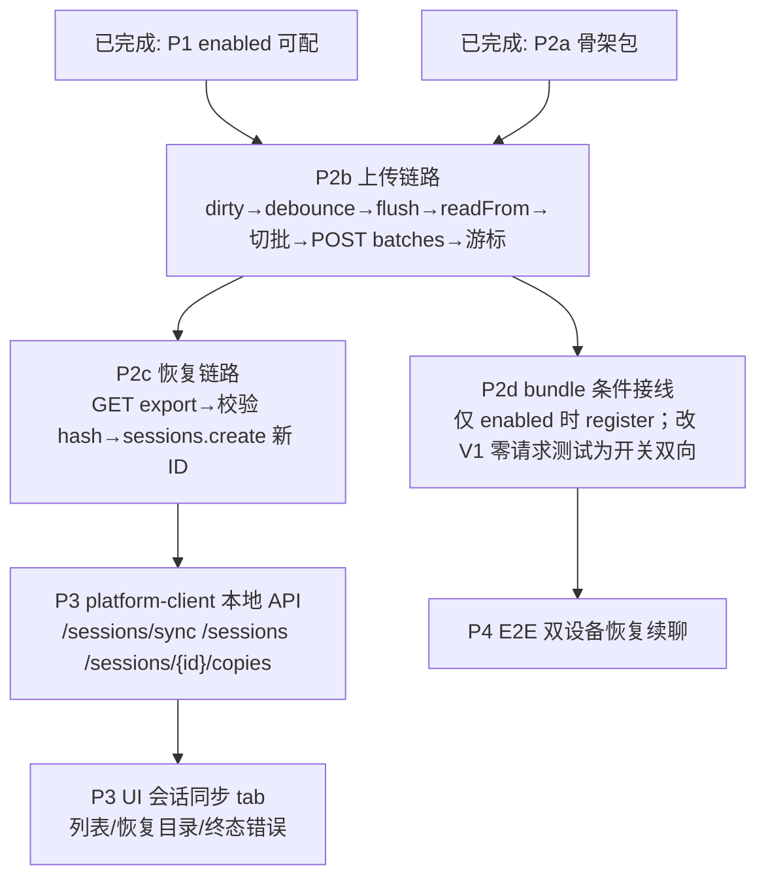

<!--
[INPUT]: 依赖 session-sync-revival-decision.md、session-sync-p1/p2a 已交付实现、docs/ecosystem/dsh-session-sync-absorption.md 与 governance design §12/§16.4、T16 服务端验收。
[OUTPUT]: 记录 Session 同步客户端点亮的已完成面、未完成面、分支拓扑与后续实施顺序，作为跨日续作真源。
[POS]: docs/compose 下 session-sync 客户端点亮的总览与待办真源；各 compose/spec 单特性文档只描述已交付切片。
[PROTOCOL]: 变更时更新此头部，然后检查 CLAUDE.md / 相关 compose spec
-->

# Session 同步客户端点亮 · 总体方案与计划

状态：`partial-delivered-roadmap`  
更新日期：2026-09-16（Asia/Shanghai）  
产品决议：`docs/session-sync-revival-decision.md`（已入 main）  
基线：DSH Desktop `2.0.3` / Harness `0.1.1-rc.2`；服务端 T16 已完成

---

## 1. 目标（未变）

员工换设备后：登录企业账号 → 会话列表 → 恢复到本机 cwd → 以**新本地 Session ID** 继续对话。

- 真源：**企业 Server**（T16 AES-GCM 事件批），不是社区 Git 镜像。  
- 默认：`enterprise.session.enabled=false`（V1 零 Session API）。  
- 冲突：**一源一写**；恢复必新 ID。  
- 个人向参考：`docs/ecosystem/dsh-session-sync-absorption.md`（分支 `feat/session-sync-ecosystem`）。

---

## 2. 已完成（可合并到 main 的切片）

| 分支 | 基点 | 内容 | Spec |
|---|---|---|---|
| `feat/session-sync-ecosystem` | `c1b788f` | 源码级吸收 dsh-session-sync；更新 work-platform 公开生态证据 | `docs/compose/spec/session-sync-ecosystem.md` |
| `feat/session-sync-p1` | `4f6d251` | `enterprise.session.enabled` 可配；bootstrap `sessionPolicy` 读 `EnterpriseSessionProperties` | `docs/compose/spec/session-sync-p1.md` |
| `feat/session-sync-p2a` | `feat/session-sync-p1` | `@dshent/session-sync` 骨架：游标原子存储 + disabled/idle 服务 + register 零副作用 | `docs/compose/spec/session-sync-p2a.md` |
| `feat/session-sync-p2b` | `feat/session-sync-p2a` | P2b 上传链路：dirty/防抖/单 worker/切批/T16 batches/游标/终态（结构端口，无 bundle 接线） | `docs/compose/spec/session-sync-p2b.md` |

**明确未做且被 V1 门禁钉住的：**

- `bundle/src/index.ts` **不**导入/调用 session 同步（`bundle.spec` 仍 `not.toContain('enterpriseSessionSync')`）。  
- 无 restore UI、无 platform-client `/sessions/*` 本地 API；上传端口尚未由 bundle 注入真实 ctx。

---

## 3. 未完成总览（按依赖）

### 3.1 P2b · 上传链路（已交付于 `feat/session-sync-p2b`）

| 项 | 规格（设计 §12.1 / §16.4） | 状态 |
|---|---|---|
| 触发 | `markDirty` / `session/event` 仅标 dirty；防抖 2s | 已交付 |
| 读增量 | `sessions.flush` → `sessionPersistence.readFrom(id, lastAckSeq+1)` | 已交付（结构端口） |
| 线协议 | 首批 header + raw JSONL + `previousRollingHash` + `payloadSha256`；`POST .../batches` | 已交付 |
| 切批 | 遵守 bootstrap `sessionPolicy.maxBatchBytes` | 已交付 |
| 终态 | SEQ_GAP / DIVERGED / SOURCE_DEVICE_CONFLICT / FORMAT_UNSUPPORTED / CONTENT_EXPIRED（+ BATCH_TOO_LARGE）不自动重试 | 已交付 |
| 并发 | 同一 session 单 worker；dispose ≤3s 等在途 | 已交付 |
| API lock | rc.2 `flush` / `readFrom` 签名已 lock 进结构端口 | 已完成 |

**吸收纪律（见 ecosystem 文档）：** 写确认 fail-closed、日志先脱敏、危险操作白名单、auto 可逆、status/diff 只读体验——**不**抄 Git keep-both 合并。

### 3.2 P2c · 恢复链路

- `GET /enterprise/api/v1/sessions` 列表  
- `GET .../export` 分页 + hash 校验  
- `ctx.sessions.create(newId, { seed, meta: { parentSession, cwd } })`  
- 失败不建半成品；随后 `restore-record` 审计（若走 host）

### 3.3 P3 · 本地 API + UI

| 本地 API（platform-client） | UI |
|---|---|
| `GET /enterprise/api/v1/local/sessions/sync` | settings 增「会话同步」tab（**仅** `sessionPolicy.enabled`） |
| `GET .../sessions` | 远端列表 + backlog |
| `POST .../sessions/{id}/copies` | 选 cwd → 确认 → 恢复 |
| （可选）delete | 二次确认删除远端副本 |

`enabled=false`：**不渲染 tab、零 Session 请求**（V1 门禁保留断言）。

### 3.4 P2d · bundle 条件接线（在 P2b 可用后）

1. bootstrap `sessionPolicy.enabled===true` 才 `registerSessionSync`。  
2. 更新 `bundle.spec` / account-store「零 Session 请求」为 **开关双向**：false 仍零请求；true 允许本地 API。  
3. **禁止**在 false 路径引入 `enterpriseSessionSync` 符号到未启用运行时。

### 3.5 P4 · 验收

- 包/单测：游标、批切分、终态、恢复失败无半成品。  
- E2E：设备 A 同步 → 设备 B 恢复 → **继续对话**；设备 B 不能向源 sessionId 上传。  
- V1 门禁：默认 false 全绿。

---

## 4. 分支与推送约定

| 分支 | 推送 | 说明 |
|---|---|---|
| `feat/session-sync-ecosystem` | 是 | 独立文档，可单独 merge |
| `feat/session-sync-p1` | 是 | 可单独 merge（不含 P2a） |
| `feat/session-sync-p2a` | 是 | **已含 P1**；推荐优先合此或 rebase 到 main 后合 |
| `main` | 本日不强制合 | 待策略决定（可 stack merge 或 PR） |

合并顺序建议：`ecosystem` → `p1`（或直接 `p2a` 含 p1）→ 再开 `p2b` 从合并后的 main 切出。

---

## 5. 今日收尾状态

| 问题 | 答案 |
|---|---|
| 客户端是否已点亮？ | **否**。仅服务端开关 + 客户端骨架 + 文档。 |
| 能否生产使用？ | **否**。无上传/恢复。 |
| 下次从哪继续？ | P2c 恢复链路，或 P2d bundle 条件接线（把真实 `ctx.sessions` / `sessionPersistence` / `enterprisePlatform.request` 注入 `registerSessionSync`）。 |
| 怎么恢复上下文？ | 读本文件 + `session-sync-p2a.md` + `session-sync-revival-decision.md` + `docs/ecosystem/dsh-session-sync-absorption.md`。 |

---

## 6. 品味自检

- **核心实现**：用三切片 + 本 roadmap 把「可合并的今天」与「必须继续的明天」切开，避免半成品 bundle 接线污染 V1。  
- **品味自检**：骨架不假装会同步；disabled 路径用测试钉死零副作用。  
- **改进建议**：P2b 开工第一件事是官方 Session Persistence API 取证，再写 worker，避免对着设计符号空转。
