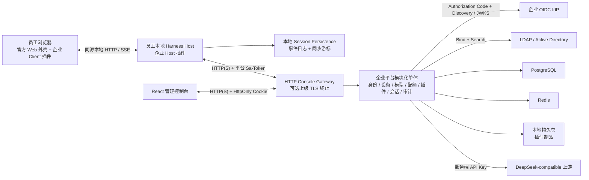
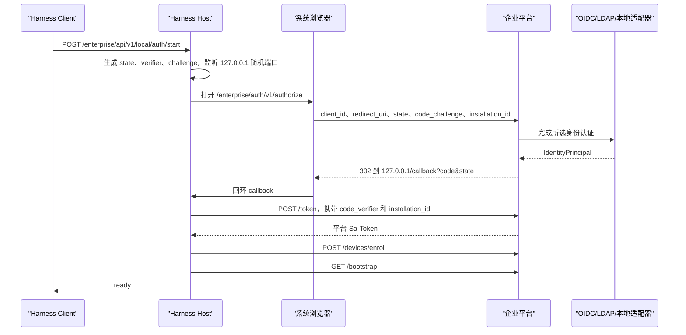

<!--
[INPUT]: 依赖产品预研、锁定上游基线、V1 功能范围与当前 Server/Console/Plugin 实现事实。
[OUTPUT]: 提供 OwnDsh MVP 的架构、协议、数据、安全、客户端交付与实施验收规格。
[POS]: 项目详细设计真源，约束代码实现与各任务验收文档，不替代 V1 产品功能清单。
[PROTOCOL]: 变更时更新此头部，然后检查 CLAUDE.md
-->

# OwnDsh 企业 Agent 治理平台 MVP 可执行详细设计

设计日期：2026-08-17

文档状态：实施基线

## 1. 文档定位

本文把[企业 Agent 工作平台预研](owndsh-work-platform.md)收敛为一份可直接用于编码、联调和试点验收的实施规格。第 1 至 21 节是设计真源，第 22 节是唯一实施顺序；开发者或 AI 不得在编码时自行扩大范围、替换技术路线或补入远期能力。

本文描述目标实现，不代表仓库已经具备这些企业能力。某项能力只有在指定代码、迁移、测试、文档和端到端验收全部完成后才算交付。

### 1.1 使用规则

1. 实现者先完成第 22 节当前任务及其依赖，不得跨过未通过验收的纵向链路并行堆功能。
2. 接口字段、数据库约束、状态转换、错误码和失败策略以本文为准；实现中发现矛盾时先修订本文，再改代码。
3. Harness 新行为必须通过锁定版本的公开插件扩展点实现；同级 Harness checkout 不得产生跟踪文件改动。发现缺少必要扩展点时停止当前任务，先向官方提交通用修改并更新版本锁，不在产品仓库复制或修改 Harness 源码。
4. 员工侧只发布 `owndsh-plugin`，不维护官方 Web/Desktop UI 分叉；安装后的唯一人工配置是 OwnDsh Server 地址。
5. 服务端以资源所有权和权限码作最终裁决，客户端隐藏按钮、模型列表和本地状态都不是授权依据。
6. 所有外部输入在 HTTP、文件、压缩包、数据库反序列化或跨进程入口校验；同进程 TypeScript 类型边界不重复做敌意输入校验。
7. 每项任务必须提交任务表指定的测试证据；“可以运行”不能替代并发、安全、失败和恢复场景。

### 1.2 已核对的基线

| 代码库 | 冻结基线 | 用途 |
|---|---|---|
| [DSH Desktop](https://github.com/anywhere-labs/dsh-desktop) | 版本 `2.0.3`，提交 `1eb398d78108de1303ce29b1aeaf70aaf96acee4` | 员工主客户端、Electron 生命周期、profile 与插件管理 |
| DeepSeek Harness | Desktop gitlink 派生版本 `0.1.1-rc.2`，提交 `b150a551b8d465e31e418e1b2eaf5e79bbb7d28e` | 员工本地 Runtime、Host/Client 插件和普通 Web 兼容面 |
| OwnDsh Server | 版本 `0.1.0`，由产品仓库自主维护 | 企业服务端底座 |
| Java 及服务端框架 | Java 21、Spring Boot 4.1.0、Sa-Token 1.45.0、MyBatis-Plus 3.5.17 | 服务端运行时 |
| 管理端前端 | React 19、Vite 8、TanStack Router/Query/Table/Form、TypeScript 6 | OwnDsh Console |
| Harness 工具链 | 仓库锁定的 Node、pnpm、TypeScript、React、Cordis、Typert 和 Vitest | 不单独升级 |
| 数据组件 | PostgreSQL 17.x、Redis 7.4.x、Nginx 1.28.x | Compose 在 T21 固定可获得的 patch 版本与镜像 digest |

产品仓库以 `upstream/dsh-desktop.lock.json` 锁定发行版本，并要求 `upstream/deepseek-harness.lock.json` 与其 Harness gitlink 完全一致。正式编码只检出机器锁 commit，不自动拉取上游默认分支；升级必须先选 Desktop 发行，再运行基线、插件和 Web/Desktop 组合门禁。若公开接口发生变化，只调整企业插件，不把旧接口兼容层带入 MVP。

OwnDsh Server 由本项目自主维护，原始代码的 MIT 许可证保留在 `server/LICENSE`。Console 直接派生的 Beautiful UI 源码使用 `console/BEAUTIFUL_UI_LICENSE` 保留 MIT 许可证与 `upstream/beautiful-ui.lock.json` 来源；已退役前端不再进入源码或交付物。

### 1.3 已冻结的产品与技术决策

| 主题 | 决策 |
|---|---|
| 产品形态 | 员工运行锁定 DSH Desktop；普通 Harness Web 保留兼容。中心平台只管理身份、模型、配额、插件、会话副本和审计，不执行员工工具，也不挂载员工工作区 |
| 交付物 | 一个企业后台安装包、一个基于锁定 DSH Desktop 的桌面客户端和一个 Web/Desktop 共用企业插件包；后台包含 Spring Boot、React 管理端及 PostgreSQL/Redis Compose |
| Harness 源码 | 官方仓库按完整 commit 锁定并作为同级只读开发依赖；产品仓库只保存企业插件，不 vendor、不 fork、不提交 Harness 源码 |
| 部署范围 | MVP 每套部署只服务一个企业，单个 Server 实例，Linux `amd64`，不交付 Kubernetes、Helm、多活或微服务 |
| 身份 | 企业 OIDC、LDAP/AD、本地账号分别由身份适配器认证，统一产生 `IdentityPrincipal`，再由平台签发 Sa-Token |
| Keycloak | 不作为运行依赖；只有 LDAP 企业额外需要 OIDC SSO、MFA 或身份联邦时，才把 Keycloak 当作外部 IdP 选装 |
| Harness 登录 | Authorization Code + PKCE，使用系统浏览器和本机回环地址；不实现 RFC 8628 Device Flow，不使用 Sa-Token OAuth2 模块模拟 PKCE |
| 平台会话 | 业务 API、模型网关、管理端和 Harness 只接受平台 Sa-Token；不引入 Spring Security OAuth2 Resource Server |
| RBAC | 复用 原始服务端框架 的用户、部门、角色、菜单和 Sa-Token 权限解析，迁移固定企业角色及权限码 |
| 模型 | Harness 官方 `dsh-llm-pi-ai` 负责三协议语义；企业网关只做治理和透明 upstream |
| 密钥 | 上游模型密钥只在服务端加密保存和解密使用，不进入员工设备、浏览器、Session Event 或日志 |
| 配额 | 支持默认、部门和用户三个作用域的日/月 Token、RPM 和并发限制；请求前预留，请求后结算 |
| 插件 | 只分发预构建 `.tgz` bundle，平台验包并签名，客户端校验后用 `dsh plugin` 安装，重启后生效 |
| 会话 | 本地持久化仍是真源；独立同步消费者上传完整 Session Event 日志，支持个人会话管理和恢复副本，不同步工作区文件 |
| 数据保留 | Session 正文默认 90 天，审计元数据默认 365 天，均可由部署配置修改 |
| 审计 | 使用应用级只追加审计表，不做哈希链、不可抵赖证明、风险发现或安全报告 |

## 2. MVP 目标与范围

### 2.1 必须验证的假设

| 假设 | 验证方法 | 通过标准 |
|---|---|---|
| Harness 可成为企业受管 Agent 客户端 | 不修改 `agent-loop`，通过 bundle 和插件完成登录、模型、插件、同步与员工 UI | 企业 profile 连续试用两周，所有企业行为均有明确插件所有者 |
| 企业可集中供给模型且不下发上游密钥 | 员工通过企业账号登录后直接调用已分配模型 | 员工设备和浏览器中不存在上游 API Key，伪造模型别名仍被网关拒绝 |
| 管理员可实际控制成本和可用模型 | 管理员配置 provider、模型、授权和配额后观察即时结果 | 未授权、停用、超日/月限额、超 RPM 和超并发请求都由服务端拒绝 |
| 通用插件可受管分发 | 管理员上传预构建 bundle 并分配给用户或部门 | 客户端验签、安装、提示重启、激活、清单上报和回滚形成闭环 |
| 会话留痕可跨设备使用 | 本地日志增量上传，另一台设备登录后恢复为可继续的本地副本 | 正常网络 RPO 不超过 60 秒，恢复副本事件序列与远端完全一致 |
| 平台具备企业采购所需的基本可追溯性 | 管理员按用户、时间、动作和 requestId 查询 | 登录、模型、配额、插件、会话和管理变更都有服务端审计记录 |

### 2.2 MVP 必须交付

- OIDC、LDAP/AD 和本地账号登录适配器，统一平台 Sa-Token 会话及设备撤销。
- 固定 RBAC、用户和部门复用、身份源管理及外部身份映射。
- DeepSeek-compatible provider、受管模型、用户/部门授权、默认模型和停用控制。
- 日/月 Token、RPM 和并发配额，流式调用预留、结算和用量查询。
- 三协议透明流式模型网关及 Harness 官方 `dsh-llm-pi-ai` 企业 profile。
- 预构建 bundle 上传、校验、签名、分配、下载、安装、重启激活、清单和回滚。
- 本地 Session Event 增量同步、远端个人会话列表、内容查看、删除、保留和恢复副本。
- 登录、设备、模型、用量、插件、会话和管理变更审计。
- React 管理控制台和 Harness 员工设置页。
- 单机 Docker Compose、初始化脚本、备份说明、升级与回滚说明。

### 2.3 明确不做

- 项目、共享会话、多人写入、评论、会话接管和协作权限。
- Policy Engine、远程工具审批、DLP、风险监控、安全报告和法务保全。
- Agent Team、远程 subagent、企业 Runner、长任务调度和无人值守执行。
- 多企业 SaaS、租户自助开通、跨地域容灾、多实例 Server、Kafka、Elasticsearch 和对象存储必选依赖。
- Kubernetes、Helm、`arm64` 服务端镜像和自动伸缩。
- 任意 npm/Git URL 安装、源码在线构建、安装脚本、原生 `.node` 插件和未知依赖下载。
- 工作区文件、Git 仓库、终端记录以外的数据同步；Session 中已经记录的工具输入输出仍按原日志同步。
- 阻止员工运行个人 profile、其他编程工具或直接访问外部模型；MVP 只治理企业 profile 与企业网关。
- 通用 OAuth2 授权服务器、refresh token、Device Grant、SAML、WebAuthn 和自建 MFA。
- Harness 移动端设置页适配。MVP 员工插件是桌面工作台能力；未来移动端认证与交互由独立产品入口设计，不复用未公开的桌面 Settings shell 内部状态。

## 3. Harness 现状与采用方式

### 3.1 可直接复用的能力

| 需求 | Harness 当前能力 | MVP 接入方式 |
|---|---|---|
| 插件组合 | Cordis `Context`、`Service`、typed events、effects、Loader、bundle 和 profile | 企业能力全部作为插件与 bundle 叠加 |
| 模型 | `ctx.llm`、`LlmAdapter`、动态模型目录、`llm/stream` 和流式 `TokenUsage` | 注册唯一 provider 路由 `enterprise` |
| 会话 | 仅追加 Session Event、`session/event`、`ctx.sessions.flush()`、`ctx.sessionPersistence.readFrom()` | 同步插件在本地持久后读取后缀并上传 |
| 本地持久化 | JSONL/SQLite provider、恢复、格式拒绝和连续 seq 校验 | 不替换、不代理、不让网络进入本地 append 路径 |
| UI | Client module、`ctx.slots.register()`、`settings.section`、`sidebar.footer.action`、`shell.overlay` | 增加企业设置、连接状态和强制登录门禁，不维护官方 UI 分叉 |
| Host/Client 协作 | `ctx.webServer.register()`、`dsh.client` Client module 和普通 Client 插件 | Host 插件提供同源 `/enterprise/api/v1/local/*` HTTP/SSE；Client 插件通过浏览器 `fetch`/`EventSource` 调用，不扩展上游 Typert Remote 集合 |
| 插件安装 | `dsh plugin --profile <name> add <tgz>`、`dsh.bundle`、profile patch 层 | 分发插件调用现有 CLI，不实现第二套包管理器 |
| 运行清单 | `pluginInventory/list` 返回 Loader entry 和 fiber 状态 | 与企业安装状态合并后上报 |
| 配置 | Schemastery `Config`、settings 与 credential reference | Server 地址进入官方 settings；部署默认值进入 bundle Config，平台 Token 不写入磁盘 |

企业功能不能依赖动态 Cordis runner。动态 runner 的 `node:vm` 不是安全隔离，定义在内存中且重启丢失，不适合作为企业软件分发机制。

2026-08-18 对照官网插件教程、锁定源码和官方最新 `master` 后确认：`typertPlugin({ mode: 'package' })` 是 Harness 自身 Typert workspace 的生成粒度，不是普通树外插件的发布入口。此前把自定义 Typert Remote 当作企业插件必经路线属于产品设计误判，不是 Harness 官方插件机制缺陷。MVP 改用官方稳定组合面：Host 逻辑通过 Cordis `apply(ctx)` 注册服务、事件和 `ctx.webServer` 路由；浏览器逻辑通过 `dsh.client` Client module 与 UI slot 组合；企业专有协议由插件自有同源 HTTP/SSE 承载。产品不再生成、挂载或修改自定义 Remote contribution，也不需要 ambient protocol shim。

T07 最初在 rc.7 验证 `settings.section` 与 `sidebar.footer.action`，迁移到 rc.2 后又核对 `shell.overlay` 与 `@deepseek-ai/dsh-settings`。当前门禁通过 `shell.overlay` 覆盖未配置、未登录和失效状态，Server 地址由官方 settings 持久化；sidebar 只展示/刷新状态，企业详情仍归官方 Settings 导航所有。禁止查询 Harness DOM、修改私有 React 状态或复制官方 UI。T07 只按桌面视口验收；移动端属于第 2.3 节明确不做范围。

2026-08-27 起发行基线改为 DSH Desktop 2.0.3 及其 Harness 0.1.1-rc.2 gitlink。企业 bundle 在 Desktop 中读取公开 `desktopProfiles.current`，并通过 `desktopPnpm.runPlugin()` 管理当前 profile；普通 Web 继续走官方 `dsh plugin` CLI。Electron renderer 仍是 Web Client，因此企业 bundle 的 `dsh.client.platform` 保持 `web`。迁移影响与验证证据见 [`desktop-2.0.3-harness-rc2-migration.md`](desktop-2.0.3-harness-rc2-migration.md)。

### 3.2 必须新增的能力

| 能力 | 新增所有者 |
|---|---|
| 平台登录、Sa-Token 内存会话、设备注册、bootstrap 和统一 HTTP client | `@owndsh/platform-client` |
| 企业模型 profile、本机认证代理和官方模型插件挂载 | `@owndsh/llm-gateway` + `@deepseek-ai/dsh-llm-pi-ai` |
| Session Event 队列、游标、上传、远端列表和恢复副本 | `@owndsh/session-sync` |
| 受管插件期望状态、制品验证、CLI 安装和清单上报 | `@owndsh/plugin-distribution` |
| Host/Client DTO、错误码和生成客户端 | `@owndsh/contracts` |
| Server 配置、登录门禁、账号和插件 UI | `@owndsh/ui` |
| 企业 profile patch 层 | `owndsh-plugin` |
| 中心身份、模型、配额、分发、同步与审计 | 原始服务端框架 `owndsh-enterprise` 模块 |

实现前依次阅读锁定 commit 的[架构](https://github.com/deepseek-ai/deepseek-harness/blob/99f6f02fecdb7dff40c3fbc9470f5907c29f74ca/docs/architecture.zh.md)、[Cordis 入门](https://github.com/deepseek-ai/deepseek-harness/blob/99f6f02fecdb7dff40c3fbc9470f5907c29f74ca/docs/cordis-primer.zh.md)、[第一个插件](https://github.com/deepseek-ai/deepseek-harness/blob/99f6f02fecdb7dff40c3fbc9470f5907c29f74ca/docs/user/develop/basic/index.zh.md)、[插件发布](https://github.com/deepseek-ai/deepseek-harness/blob/99f6f02fecdb7dff40c3fbc9470f5907c29f74ca/docs/user/develop/basic/publish.zh.md)、[Web server](https://github.com/deepseek-ai/deepseek-harness/blob/99f6f02fecdb7dff40c3fbc9470f5907c29f74ca/docs/subsystems/web-server.zh.md)、[Client modules](https://github.com/deepseek-ai/deepseek-harness/blob/99f6f02fecdb7dff40c3fbc9470f5907c29f74ca/docs/subsystems/client-modules.zh.md)、[LLM 服务](https://github.com/deepseek-ai/deepseek-harness/blob/99f6f02fecdb7dff40c3fbc9470f5907c29f74ca/packages/llm/llm/README.zh.md)、[Session Persistence](https://github.com/deepseek-ai/deepseek-harness/blob/99f6f02fecdb7dff40c3fbc9470f5907c29f74ca/packages/session/session-persistence/README.zh.md)和[UI slots](https://github.com/deepseek-ai/deepseek-harness/blob/99f6f02fecdb7dff40c3fbc9470f5907c29f74ca/packages/client/ui-slots/README.zh.md)。

## 4. 总体架构



员工本地 Host 是代码、文件、进程和 Session 的执行位置。中心平台不获得工作区文件系统访问权；同步内容只来自 Harness 已持久化的 Session Event。

模型网关与管理 API 位于同一个 Spring Boot 进程，但代码模块和事务职责分开。MVP 不为“将来可能扩容”提前拆微服务。

### 4.1 部署单元

| 单元 | 数量 | 约束 |
|---|---|---|
| Harness 企业 profile | 每台员工设备一个 | 支持 Harness 当前支持的员工操作系统；平台 Token 仅存 Host 内存 |
| Spring Boot Server | 一个 | Linux `amd64`；健康检查失败由 Docker 重启 |
| React 管理端 | 一份静态资源 | 与 Server 同域发布，避免生产 CORS |
| PostgreSQL | 一个 | 业务事实、用量账本、Session 副本和审计 |
| Redis | 一个 | Sa-Token、登录事务、OIDC state/nonce、RPM 和并发 lease |
| 插件制品目录 | 一个持久卷 | 按 SHA-256 寻址；数据库只存引用和元数据 |
| HTTP Console Gateway | 一个 | Compose 只发布 HTTP 8080；部署方可在外层终止 TLS，Server、PostgreSQL、Redis 不发布宿主端口 |

### 4.2 源码与交付目录

MVP 只有一个产品 Git 仓库。DeepSeek Harness 按 `upstream/deepseek-harness.lock.json` clone 到同级目录，作为只读开发与组合测试依赖，不进入产品仓库。

```text
agent-platform-workspace/
  deepseek-harness/                         # 官方仓库的锁定 commit，不含企业修改
  owndsh/                # 产品私有仓库
    server/                                # Java/Spring Boot 服务端
      owndsh-modules/owndsh-enterprise/
      owndsh-server/
      pom.xml
    console/                                # Vite/TanStack 产品控制台
    plugin/                                 # 独立 pnpm workspace，只保存企业插件
      packages/
        contracts/
        platform-client/
        llm-gateway/
        session-sync/
        plugin-distribution/
        ui/
        bundle/
    contracts/
      enterprise-openapi.yaml               # HTTP 协议真源
    deploy/
      compose/
      nginx/
      scripts/
    docs/
    scripts/
    upstream/
      deepseek-harness.lock.json
```

`owndsh` 只允许从机器锁导入固定 Server 宿主基线到 `server/`，移除嵌套 `.git` 并保留许可证。`console/` 是产品自有前端，不从旧管理端导入；Harness 企业插件使用产品自己的 npm scope，通过与锁定 Harness 版本相同的公开 `@deepseek-ai/dsh-*` 包编译；组合测试在同级 Harness checkout 中安装生成的 `.tgz`，不得使用跨仓库源码 import。

Harness 升级只修改版本锁和企业插件依赖版本。升级验证前，同级 checkout 必须干净并检出锁定 commit；验证过程中不得把 Harness 源码、`.git`、`node_modules` 或构建产物复制进产品仓库。

交付包包含 Server 镜像、管理端静态资源、Compose 文件、数据库迁移、企业 bundle `.tgz`、安装脚本、许可证和运维文档。企业核心 bundle 由安装包安装，不允许通过通用插件分发功能更新或卸载自身。

## 5. 服务端代码设计

### 5.1 服务端宿主集成点

在 `server/owndsh-modules/pom.xml` 聚合 `owndsh-enterprise`，在 `server/owndsh-server/pom.xml` 增加运行依赖。MVP 删除或禁用演示、工作流、AI 示例、SnailJob 和多租户管理菜单，但不改写宿主框架的 Sa-Token、用户、角色和基础 Web 设施。

每套部署只启用一个固定 原始服务端框架 tenant。企业业务实体保留 `tenant_id` 并复用框架拦截器，但客户端不能传入、切换或创建 tenant；服务端从部署配置和当前登录上下文写入固定值。本文不宣称或测试 SaaS 级租户隔离。

### 5.2 Java 包结构

```text
com.owndsh.enterprise
  common/
    api/             EnterpriseResponse、EnterpriseError、requestId
    crypto/          SecretCipher、KeyMaterialProperties
    validation/      URL、ID、分页和 revision 校验
  auth/
    domain/          IdentityPrincipal、IdentitySourceType
    adapter/         IdentityAdapter、OidcIdentityAdapter、LdapIdentityAdapter、LocalIdentityAdapter
    application/     LoginTransactionService、AuthorizationCodeService、PlatformSessionService
    web/             EnterpriseAuthController
  device/
    application/     DeviceService
    persistence/     DeviceMapper
    web/             DeviceController、AdminDeviceController
  model/
    application/     ProviderService、ManagedModelService、ModelGrantService
    gateway/         ModelGatewayController、DeepSeekUpstreamClient、三协议透明 SSE relay
    persistence/     ProviderMapper、ModelMapper、ModelGrantMapper
    web/             AdminModelController、BootstrapController
  quota/
    application/     QuotaResolver、QuotaReservationService、QuotaSettlementService
    infrastructure/  RedisRateLimitStore、ReservationRecoveryJob
    persistence/     QuotaPolicyMapper、QuotaWindowMapper、UsageMapper
  plugin/
    application/     PluginArtifactService、PluginAssignmentService
    infrastructure/  TgzInspector、ArtifactStore、PluginSigner
    web/             PluginRuntimeController、AdminPluginController
  session/
    application/     SessionReplicationService、SessionRestoreService、SessionRetentionJob
    persistence/     SessionReplicaMapper、SessionEventMapper
    web/             SessionRuntimeController、AdminSessionController
  audit/
    application/     AuditService、AuditRetentionJob
    persistence/     AuditEventMapper
    web/             AdminAuditController
```

Controller 只做协议解析、校验和权限入口；Application Service 拥有事务与状态转换；Mapper/Repository 只做持久化；外部 OIDC、LDAP、文件和模型 HTTP 客户端位于 adapter 或 infrastructure。功能模块不能调用另一个模块的 Controller 或 Mapper，只调用对方 Application Service 的公开方法。

### 5.3 管理端目录

```text
console/src/
  api/          # OpenAPI 生成客户端
  auth/         # Cookie 会话与固定角色路由
  routes/       # TanStack 文件路由
  ui/           # Beautiful UI 与产品基础控件
```

页面可见性由固定产品角色决定，Server 权限码仍是最终裁决，页面必须处理 `403`。前端不复制服务端授权算法，不缓存 provider 密钥，不将 Session 正文写入浏览器持久存储。

### 5.4 HTTP 协议真源

`contracts/enterprise-openapi.yaml` 是管理端和 Harness 中心 HTTP 的唯一手写协议真源。成功响应统一为 `{"data":...,"requestId":"req_..."}`，失败响应统一使用第 17 节结构；模型网关保持三种上游协议的原生请求、SSE 和错误字段，不套通用响应。

协议文件先于 Controller 编写。管理端使用现有 `@umijs/max-plugin-openapi` 生成 API 类型；Harness 使用 `@hey-api/openapi-ts` 的 TypeScript、Fetch client 和 Zod 插件生成类型、请求函数与运行时 schema。Server DTO 使用 Jakarta Bean Validation，MockMvc contract test 对照同一 OpenAPI。生成目录不得手工编辑，所有生成器版本进入 lockfile；CI 比较生成结果，发现未提交漂移即失败。

## 6. 身份、平台会话与设备

### 6.1 统一身份结果

所有身份适配器只能返回以下内部对象，不得把外部 access token、refresh token、LDAP 密码或原始 claims 传给业务模块。

```ts
interface IdentityPrincipal {
  sourceId: string
  sourceType: 'OIDC' | 'LDAP' | 'LOCAL'
  externalSubject: string
  username: string
  displayName: string
  email?: string
  externalGroups: string[]
}
```

OIDC 的稳定身份是 `(source_id, issuer, subject)`，不得用 email 或 username 合并账号。LDAP 的 `externalSubject` 必须来自配置的稳定属性，Active Directory 默认 `objectGUID`，标准 LDAP 默认 `entryUUID`；无法读取稳定属性时登录失败，不退回用户名。

首次成功登录创建或绑定 `sys_user`。后续登录只更新显示名、邮箱、最后登录时间和已配置的部门映射，不自动提升角色。外部组只按显式 `external_group -> sys_dept` 映射更新部门，未映射组忽略并记录元数据审计。

### 6.2 身份适配器

| 类型 | 必填配置 | 行为 |
|---|---|---|
| OIDC | `issuer`、`clientId`、加密的 `clientSecret`、`scopes`、claim 映射 | 使用 Nimbus 完成 Discovery、Authorization Code、PKCE、nonce、JWKS 轮换和 ID Token 校验 |
| LDAP/AD | `url`、`baseDn`、manager DN/密码、用户过滤器、稳定 ID 属性、显示名属性 | manager bind 搜索用户 DN，再以用户密码 bind；过滤器参数必须 LDAP escape |
| LOCAL | 原始服务端框架 本地用户 | 复用现有密码哈希、锁定、验证码和失败次数策略 |

OIDC issuer、authorization endpoint、token endpoint 和 JWKS URI 必须使用 HTTPS，开发环境仅可通过 `enterprise.auth.allowInsecureOidc=true` 显式允许 HTTP。LDAP 生产配置使用 LDAPS 或 StartTLS。

### 6.3 Harness Authorization Code + PKCE

平台只为两个固定 public client 提供最小登录门面：`dsh-desktop` 和 `enterprise-admin`。它不是通用 OAuth2 产品，不提供动态 client、scope 审批、refresh token、implicit、password、client credentials 或 Device Grant。



`redirect_uri` 只允许注册过的管理端 URI，或 `http://127.0.0.1:<1024-65535>/callback`；不接受 `localhost`、通配域名、非回环 IP、URL user-info、fragment 或额外路径。`state` 在 Host 内存校验，PKCE 只接受 S256，verifier 长度为 43 至 128 个 ASCII 字符。

`dsh-desktop` 的 authorize 请求必须携带 UUID v4 `installation_id`，登录事务和授权码都绑定该值；token 请求必须再次提交相同值。`enterprise-admin` 不接受 `installation_id`，只接受配置中的精确 HTTP(S) redirect URI。两个 client 的参数集合不能混用。

登录事务在 Redis 保存 5 分钟，授权码保存 60 秒且只能消费一次。授权码记录绑定 client、redirect URI、challenge、用户和 installation ID；任何字段不一致都原子消费失败。OIDC state/nonce 与平台授权码分开保存。

LOCAL 初始化管理员先以账号、初始密码和验证码完成一次认证；若仍带 `password_change_required`，密码端点返回 `409 CHANGE_PASSWORD` 和 Redis 中 5 分钟的一次性 challenge。页面收到后立即清空并禁用账号、初始密码和验证码，第二步只提交原事务/身份源/CSRF、challenge 与新密码。challenge 绑定 tenant、事务、身份源和已认证 userId，并以 `GETDEL` 原子消费；弱密码轮换新 challenge，成功或重放后旧 token 均失效。普通非 JSON 表单不承载 challenge，改密分支 fail-closed，避免 token 进入 URL、历史或 Referer。

授权码交换成功后调用 Sa-Token 创建不共享会话。`dsh-desktop` 只使用 `POST /token`，以 `deviceType=harness`、`deviceId=installationId` 返回 Bearer Token；`enterprise-admin` 只使用 `POST /browser-session`，以 `deviceType=console` 和登录事务生成的随机 session device ID 写入 HttpOnly Cookie，不创建 `ent_device`，也不返回 Token JSON。两类会话绝对有效期均为 12 小时，权限按当前用户解析。MVP 不签发 refresh token；过期后重新走浏览器登录，企业 IdP 的现有 SSO 会话可减少重复输入。

平台 Token 只保存在 Harness Host 内存，不写 `settings.yaml`、`.credentials.yaml`、Session、日志或 Client 浏览器。Client 只能通过 Host 注册的同源本地 API 查询脱敏状态和触发动作，永远拿不到 Token 字符串；本地 API 不能返回、转发或序列化平台 Token。

管理端使用 `enterprise-admin` PKCE，Token 只进入 HttpOnly/SameSite=Strict/host-only Cookie：外部地址为 HTTPS 时使用 `__Host-enterprise-admin` 并设置 `Secure`，HTTP 时使用 `enterprise-admin`。JavaScript 不读取或保存 Token，新标签直接复用 Cookie；管理写请求与注销还必须通过服务端 Origin/Referer 同源校验。Sign out 和本人改密由服务端撤销并清 Cookie；其他标签不复制会话状态，下一次请求或刷新时按 401 返回登录。Sa-Token 的通用 Cookie 读取仍关闭，避免把其他 Cookie 误当认证凭据。

### 6.4 认证端点

| 方法 | 路径 | 认证 | 用途 |
|---|---|---|---|
| `GET` | `/enterprise/auth/v1/authorize` | 无 | 校验 client/redirect/PKCE 及对应 client 参数，创建登录事务并跳转登录页 |
| `GET` | `/enterprise/auth/v1/sources?transaction_id=...` | 无 | 返回该事务可用身份源的公开名称和类型 |
| `POST` | `/enterprise/auth/v1/password` | 无 | 第一步提交 LOCAL/LDAP 凭据；LOCAL 首次改密第二步只提交一次性 challenge 与新密码 |
| `GET` | `/enterprise/auth/v1/oidc/{sourceId}/start` | 无 | 创建 OIDC state/nonce 并跳转企业 IdP |
| `GET` | `/enterprise/auth/v1/oidc/{sourceId}/callback` | 无 | 校验回调并完成平台登录事务 |
| `POST` | `/enterprise/auth/v1/token` | 无 | 仅为 `dsh-desktop` 校验授权码、verifier 与 installation，返回平台 Bearer Token |
| `POST` | `/enterprise/auth/v1/browser-session` | 无 | 仅为 `enterprise-admin` 校验授权码和 verifier，以 `204 + Set-Cookie` 建立管理会话 |
| `POST` | `/enterprise/auth/v1/logout` | 平台会话 | 注销当前 Sa-Token；存在管理端 Cookie 时同步删除 |

密码端点只接受部署配置中的同源 HTTP(S) 地址、同一登录事务和一次性 CSRF 值，响应与用户名是否存在无关。页面客户端以 JSON `CHANGE_PASSWORD`/`REDIRECT` 步骤推进首次改密或导航回调；普通凭据失败仍可由 HTML 303 返回原事务，但首次改密不回退到重复提交账号和初始密码。密码、challenge 及外部 Token 不进入审计 metadata、异常对象或应用日志；生产环境的传输加密由部署方外层网关负责。

### 6.5 设备

`installation_id` 是客户端首次启动生成的 UUID v4，持久化到 `$DSH_HOME/enterprise/device.json`；文件只含 installation ID、显示名和创建时间，不含秘密。设备主键由服务端生成，`installation_id` 在固定 tenant 内唯一。

Token 交换把 installation ID 写进 Sa-Token login device。后续 API 从 Sa-Token 会话读取 device ID 并查询设备状态，不信任 `X-Device-Id` 作为授权凭据。管理员撤销设备时将状态改为 `REVOKED`、撤销该设备 Sa-Token，并使后续请求返回 `ENT_DEVICE_REVOKED`。

`POST /enterprise/api/v1/devices/enroll` 创建或更新当前用户设备，字段为 `installationId`、`name`、`platform`、`harnessVersion` 和 `enterpriseBundleVersion`。同一 installation ID 已绑定另一用户时返回冲突，不自动转移。

`POST /enterprise/api/v1/devices/heartbeat` 每 60 秒上报 Harness 版本、企业 bundle 版本、插件期望 revision、插件清单摘要、Session 待同步事件数和最后成功同步时间。心跳只用于可观测性，不决定模型授权。

## 7. 固定 RBAC

原始服务端框架 的 `sys_user`、`sys_dept`、`sys_role`、`sys_user_role` 和 `sys_menu` 是 RBAC 真源，Sa-Token 从这些表解析权限。企业角色由 migration 创建并标记 `built_in=true`，管理端不能删除、改名或修改其权限集合。

`built_in` 是 `sys_role` 的真实非空布尔列，不使用 remark 代替。T03 起 PostgreSQL trigger 同时拒绝固定角色行的 update/delete 和固定角色 `sys_role_menu` 集合的 insert/update/delete；用户与固定角色的 `sys_user_role` 分配仍可正常增删。

| 角色 | 权限 |
|---|---|
| `enterprise_admin` | 全部企业权限、固定角色分配、身份源、设备、模型、配额、插件、Session 正文、审计 |
| `model_admin` | provider、模型、授权、配额、用量元数据；不能读取 provider 密钥明文、Session 正文或修改身份源 |
| `plugin_admin` | 插件上传、发布、分配、回滚和设备插件状态 |
| `auditor` | 设备只读、模型用量只读、Session 元数据/正文只读、审计只读 |
| `employee` | 本人 bootstrap、模型调用、用量、设备、插件状态、Session 同步/恢复/删除 |

固定权限码如下，Controller 必须使用权限码而不是角色名保护；角色只是权限码集合。

| 模块 | 读权限 | 写权限 |
|---|---|---|
| 身份源 | `ent:identity:read` | `ent:identity:write` |
| 用户与设备 | `ent:device:read` | `ent:device:revoke` |
| 模型 | `ent:model:read` | `ent:model:write` |
| 授权与配额 | `ent:grant:read` | `ent:grant:write` |
| 插件 | `ent:plugin:read` | `ent:plugin:write` |
| Session 元数据 | `ent:session:read` | `ent:session:delete` |
| Session 正文 | `ent:session:content:read` | 无独立写权限 |
| 审计 | `ent:audit:read` | 无 |

员工接口不依赖 `employee` 角色判断，而是要求已登录、设备有效并校验资源所有者为当前用户。这样新增普通用户时不会因漏分角色而获得管理员权限，也不会因角色数据延迟而绕过本人资源检查。

## 8. Bootstrap 与本地连接状态

`GET /enterprise/api/v1/bootstrap` 是 Harness 登录后的完整配置快照。它返回当前用户、设备、有效模型、有效配额、插件期望状态、保留策略和各模块 revision，不返回身份源秘密、provider 凭据、其他用户或 Session 正文。

```json
{
  "data": {
    "revision": 42,
    "user": {
      "id": "10031",
      "username": "zhangsan",
      "displayName": "张三",
      "departmentId": "210"
    },
    "device": {
      "id": "90018",
      "installationId": "4fbec6ac-05fb-4bc7-8457-709647d9fe76",
      "status": "ACTIVE"
    },
    "models": [
      {
        "alias": "deepseek-chat",
        "displayName": "DeepSeek Chat",
        "contextWindow": 65536,
        "maxOutputTokens": 8192,
        "reasoning": false,
        "isDefault": true
      }
    ],
    "quotas": [
      {
        "policyId": "73001",
        "scope": "USER",
        "dailyTokenLimit": 1000000,
        "monthlyTokenLimit": 20000000,
        "rpm": 20,
        "concurrency": 2
      }
    ],
    "plugins": {
      "revision": 7,
      "assignments": [
        {
          "packageName": "@example/dsh-code-review",
          "version": "1.2.0",
          "sha256": "hex...",
          "downloadUrl": "/enterprise/api/v1/plugins/versions/880/download",
          "required": true,
          "desiredState": "INSTALLED"
        }
      ]
    },
    "sessionPolicy": {
      "enabled": true,
      "retentionDays": 90,
      "maxBatchBytes": 1048576
    }
  },
  "requestId": "req_01K..."
}
```

`revision` 是影响任一 bootstrap 字段的全局单调 revision，管理写事务成功后递增。Host 登录后立即拉取，ready 状态每 60 秒刷新；响应 revision 未变化时仍更新连接时间，不重建本地服务。刷新失败使用指数退避，最大间隔 60 秒。

连接状态固定为：

```text
SIGNED_OUT -> AUTHORIZING -> ENROLLING -> BOOTSTRAPPING -> READY
      ^             |            |              |             |
      |             v            v              v             v
      +---------- CANCELLED    FAILED          FAILED       REFRESHING
                                                               |
                                               AUTH_EXPIRED <--+--> DEVICE_REVOKED
```

只有 `READY` 可以发起企业模型调用、同步 Session 或安装新插件。控制面不可达时保持本地 Session 和工具可用，但企业模型调用明确失败；不得回退个人 provider、个人 API Key 或过期 bootstrap。

## 9. 受管模型

### 9.1 模型对象

`ent_model_provider` 表示一个上游端点及密钥，`provider_type` 区分 `DEEPSEEK_OFFICIAL` 与 `CUSTOM`，稳定 `provider_key` 和 `api_protocol` 对齐 DeepSeek Harness 路由配置；自定义提供商可选择 `openai-completions`、`openai-responses`、`anthropic-messages`，DeepSeek 官方路由固定为 `openai-completions`。`ent_managed_model` 表示员工可选择的模型别名，包含 `alias`、上游模型名、上下文、最大输出和启用状态。`alias` 在固定 tenant 内唯一，员工请求只携带 alias。

`ent_model_grant` 把模型分给 `USER` 或 `DEPT`。有效授权是用户授权与当前部门授权的并集；模型和 provider 都必须为 `ACTIVE`。同一优先级最多一个 `is_default=true`，用户默认优先于部门默认；没有显式默认时按管理端排序最小的有效模型作为默认。无有效模型时 bootstrap 返回空数组，Host 显示“未分配企业模型”并拒绝调用。

客户端提交 alias 不能选择 provider、`base_url`、上游模型或 credential。网关按当前用户重新解析授权和 route，忽略任何伪造的路由 header。

### 9.2 Harness 官方模型协议层

`@owndsh/llm-gateway` 不实现 `LlmAdapter`。它把 bootstrap 模型目录投影为官方 `PiAiProviderProfile`，并在隔离的 settings scope 中直接挂载 `@deepseek-ai/dsh-llm-pi-ai`。

- 按 `openai-completions`、`openai-responses`、`anthropic-messages` 建立独立 provider route；模型选择、消息、tools、reasoning、Responses replay、SSE、取消和错误语义全部由官方插件负责。
- `contextWindow`、`maxTokens`、`reasoningEfforts` 和 `compat` 只做 profile 字段投影，企业代码不解释档位或重写协议正文。
- loopback-only 本机代理只把内存平台 Token 注入中心请求，并强制 `Accept: text/event-stream, application/json`；模型长流不设总时限，建连前错误仍保持 JSON，请求和响应字节保持透明。
- 所有中心请求携带 UUID v4 `Idempotency-Key`、`X-Harness-Version` 和 `X-Enterprise-Bundle-Version`；服务端不增加 provider 特定重试，协议与重试语义由锁定 Harness 持有。

bootstrap 模型目录变化后，插件按 profile 指纹调用官方 Cordis fiber `update`，目录 topology 和 `llm/adapters-updated` 仍由 `ctx.llm` 管理，不增加新的模型目录事件。

企业 bundle 把 `agent-default-model` 配置为 provider `enterprise`、model `enterprise/default`。平台仍按当前用户重新解析该 sentinel；它不作为普通管理 alias 创建。bundle 禁用 base profile 的个人 provider 和个人模型设置页，由企业 row 挂载隔离的官方插件实例，但不声称能阻止用户运行其他 profile。

### 9.3 网关协议

Server 分别提供 `POST /enterprise/gateway/v1/chat/completions`、`POST /enterprise/gateway/v1/responses` 和 `POST /enterprise/gateway/v1/messages`。`model` 只能是有效 alias 或 `enterprise/default`；网关只校验 `stream=true`、协议输出上限和请求体大小，其他官方协议字段及多模态内容保持透明。

网关执行顺序固定为：

1. 校验 Sa-Token、设备状态、请求体、idempotency key 和模型授权。
2. 解析所有适用配额，原子完成 Token 预留、RPM 获取和并发 lease。
3. 解密 provider 密钥，构造固定 base URL 并建立上游 SSE；非 2xx 或建连失败时保持 `RESERVED` 并释放。
4. 上游确认 2xx SSE 后，同事务写 `MODEL_REQUEST_ACCEPTED` 审计并把 reservation 标记为 `SENT`。
5. 原样消费上游 SSE，过滤上游内部 header，把协议原生 event 写给客户端。
6. 收到 usage 后结算实际 Token；未收到 usage 的不确定请求按全部预留量结算。
7. 释放并发 lease，写 usage ledger 和 `MODEL_REQUEST_FINISHED` 审计。

上游 API Key 只能在第 4 步的局部变量中出现。HTTP client、异常、metrics、MDC、审计、数据库 SQL 日志和响应都不得记录 Authorization header、请求正文或 provider 原始错误正文。

### 9.4 provider 密钥加密

部署通过 `ENT_MASTER_KEY_FILE` 提供 32 字节 master key。`SecretCipher` 使用 RFC 5869 HKDF-SHA-256，extract 使用 32 字节全零的 empty salt，expand info 分别为 ASCII `identity-secret`、`provider-secret` 和 `session-content`，派生三个 AES-256-GCM key；每次加密使用随机 12 字节 nonce，AAD 为 `tenant_id:table:id:field:key_version`。

数据库保存 ciphertext、nonce 和 key version。创建 provider 时密钥必填；更新时空值表示保持原密钥，显式 `replaceSecret=true` 才替换。任何读取 API 只返回 `credentialConfigured=true/false`，永不返回明文或密文。

MVP 只支持 `key_version=1`，不实现在线轮换。丢失 master key 意味着 provider 密钥和 Session 正文不可恢复，部署和备份文档必须把它列为独立备份项。

## 10. 配额与用量

### 10.1 生效规则

配额策略作用域为 `DEFAULT`、`DEPT` 或 `USER`。一次请求应用所有启用且字段非空的匹配策略，每条策略都是独立上限；只要任一策略拒绝，整个请求拒绝。这样部门总额度和用户个人额度可以同时生效。

日窗口按部署时区的自然日计算，月窗口按自然月计算；部署时区在首次 migration 后不可修改。Token 使用量为上游 `input_tokens + output_tokens + cache_read_tokens + cache_write_tokens` 中可获得字段的和。

T09 首次启动时把 `ENT_DEPLOYMENT_TIME_ZONE` 原子写入 `ent_quota_runtime_config`；后续启动只接受与数据库一致的值，禁止通过重启改变已经开始累计的自然日/月边界。reservation 必须同时固化服务端 `request_id`，使进程崩溃后的恢复结算仍能生成与 accepted 审计相同关联键的 ledger 和 finished/recovered 审计。

### 10.2 预留算法

输入估算为模型可见 system、messages 和 tools JSON 的 UTF-8 字节数除以 3 后向上取整。输出预留为请求 `max_tokens`，缺省时使用受管模型 `max_output_tokens`。`estimated_tokens = estimated_input + reserved_output`。

`reserve(request)` 在一个 PostgreSQL `READ COMMITTED` 事务中执行：

1. 按 quota policy ID 升序创建或锁定当前日/月 `ent_quota_window` 行，避免并发死锁。
2. 对每一行校验 `used_tokens + reserved_tokens + estimated_tokens <= limit`。
3. 任一失败则回滚全部行并返回具体 policy 和 reset time。
4. 全部通过后增加每一行 `reserved_tokens`，插入一条 `RESERVED` reservation；`reserved_windows_json` 固化本次涉及的 window ID、policy ID、window type 和预留量，后续结算不重新按当前策略推导。
5. 提交后通过单个 Redis Lua 脚本获取所有适用 policy 的 RPM 和并发 lease；失败时立即释放数据库 reservation。

RPM 使用 60 秒滑动窗口，key 包含 policy ID。并发 lease TTL 为 120 秒，Server 在流式调用期间每 30 秒续租；完成、取消或确定失败时主动释放，进程崩溃后由 TTL 回收。reservation 创建时令 `expires_at=now+15 分钟`，进入 `SENT` 后每分钟随 lease 心跳把它续到 `now+15 分钟`。

### 10.3 结算状态

```text
RESERVED -> SENT -> SETTLED
    |          |
    v          v
RELEASED   CHARGED_MAX
```

- 上游确认 2xx SSE 前失败：`RESERVED -> RELEASED`，减少 reserved，不增加 used，也不生成 ledger。
- 上游返回 usage：`SENT -> SETTLED`，减少 estimated reservation，增加 actual usage。
- 已发送但断流、超时、客户端取消或 usage 缺失：`SENT -> CHARGED_MAX`，把全部 estimated 计入 used。
- 同一 reservation 只能结算一次，`ent_usage_ledger.reservation_id` 唯一。
- 定时恢复任务每分钟原子领取 `expires_at < now` 的非终态记录；`RESERVED` 释放，`SENT` 按最大值结算。正常续租的长流式请求不能被恢复任务提前结算。

`Idempotency-Key` 在当前用户内唯一。终态重复请求返回 `409 ENT_REQUEST_ALREADY_COMPLETED`，details 含原 requestId、result 和 usage，不重放已经丢弃的 SSE；仍在进行的重复请求返回 `409 ENT_REQUEST_IN_PROGRESS`。适配器每次 `stream` 调用生成 UUID v4，并在同一次 HTTP 建连重试内复用。

### 10.4 用量接口

`GET /enterprise/api/v1/usage/me` 返回当前用户所有适用策略的日/月上限、已用、已预留、reset time、当前 RPM 和并发。管理端可以按用户、部门、模型和时间查询 ledger，但不能看到 prompts、messages 或上游密钥。

## 11. 通用插件分发

### 11.1 制品约束

管理员只能上传由 `pnpm pack` 产生的预构建 `.tgz`。Server 使用 Apache Commons Compress 流式检查，不把未知归档直接解压到文件系统。

制品必须满足：

- 压缩大小不超过 `enterprise.plugin.maxArchiveBytes`，默认 50 MiB；解压总量默认不超过 200 MiB；entry 数默认不超过 10,000。
- 所有路径位于 `package/` 下，拒绝绝对路径、`..`、反斜杠绕过、NUL、符号链接、硬链接和设备文件。
- 根 `package/package.json` 的 `name`、`version`、`type=module`、`dsh.bundle.patch` 和 patch 文件存在。
- `scripts` 不得包含 `preinstall`、`install`、`postinstall`、`prepare`；归档不得包含 `.node`。
- `dependencies` 必须为空；Harness 依赖只能声明为与企业发行版精确兼容的 `peerDependencies`，其他运行依赖必须在构建时 bundle 进 JavaScript。
- compatibility 必须声明允许的 Harness commit 集合、企业 bundle SemVer 范围和操作系统；JSON
  字段固定为 `harnessCommits`、`enterpriseBundleRange`、`operatingSystems`。Git commit 不具备可比较
  的版本顺序，因此不得用 `min/max` 或字典序伪造 commit 范围；首个发行版至少包含锁定的
  `99f6f02fecdb7dff40c3fbc9470f5907c29f74ca`，操作系统值只允许 `darwin/linux/win32`。

上传通过后计算整个 tgz 的 SHA-256，并以 Ed25519 对签名声明的 RFC 8785 JSON Canonicalization Scheme UTF-8 结果签名。声明字段固定为字符串 `artifactId`、`packageName`、`version`、十进制整数 `sizeBytes`、小写十六进制 `sha256` 和对象 `compatibility`；服务端与客户端使用同一组规范化测试向量，禁止自行拼接字段。私钥只在 Server secret 中，公钥写进员工最初安装的企业 bundle Config；bootstrap 返回的公钥不能替换本地信任根。

制品先写 `$ENT_ARTIFACT_ROOT/tmp/<upload-id>.part`，同一 SHA-256 的 CAS 终结与数据库补偿由进程内锁加 artifact root 文件锁跨进程串行化，验包和签名成功后原子移动到 `$ENT_ARTIFACT_ROOT/sha256/<hash前两位>/<完整hash>.tgz`。数据库事务失败时删除临时文件和本次独占创建且尚未被其他事务复用的最终文件；已发布版本引用的制品不得删除，退休且无 assignment 引用的制品保留 30 天后由清理任务删除。

### 11.2 发布和分配

插件版本状态为 `UPLOADED -> VALIDATED -> PUBLISHED -> RETIRED`，只有 `PUBLISHED` 可分配。相同 package/version 或相同 SHA-256 重复上传返回已有版本，不新建记录。

分配作用域为 `ALL`、`DEPT` 或 `USER`，期望状态为 `INSTALLED` 或 `ABSENT`，并包含唯一目标版本和 `required`。解析优先级为 USER、DEPT、ALL；同一优先级冲突在管理写入时拒绝。回滚就是把 assignment 指向已发布旧版本并增加插件 revision。

管理 catalog 的每个 `PluginPackage` 必须返回该 package 当前的完整 `assignments` 集合。assignment batch 是基于 package revision 的全量原子替换，不是增量 patch；管理端编辑时必须从完整集合初始化并回传完整集合，CAS 冲突后重新加载完整服务端事实再由管理员重试，禁止只提交当前筛选或当前页可见项而静默删除其他 subject。runtime 仍只返回当前用户解析后的有效 assignment，不暴露管理集合。

### 11.3 客户端调和

`@owndsh/plugin-distribution` 在每次 bootstrap revision 变化后调和，状态固定为：

```text
UNASSIGNED -> DOWNLOAD_PENDING -> DOWNLOADING -> VERIFIED -> INSTALLING -> RESTART_REQUIRED -> ACTIVE
                       |              |             |                 |
                       +-----------> FAILED <-------+-----------------+
ACTIVE -> REMOVE_PENDING -> REMOVING -> RESTART_REQUIRED
```

下载到 `$DSH_HOME/enterprise/artifacts/<sha256>.tgz.part`，完成后校验大小、SHA-256、Ed25519 和 compatibility，再原子改名为 `<sha256>.tgz`。校验失败删除 `.part` 并上报，绝不执行 `dsh plugin`。

安装命令固定为 `dsh plugin --profile enterprise add --ignore-scripts --save-exact <absolute-tgz-path>`，移除命令固定为 `dsh plugin --profile enterprise remove <package-name>`。实现通过 `ctx.subprocess` 调用，argv 数组传参，不拼 shell 字符串；`dshCommand` 和 profile 名是 Schemastery Config，默认分别为 `dsh` 和 `enterprise`。

CLI 成功后写入 `$DSH_HOME/enterprise/managed-plugins.json`，记录 assignment revision、package、version、artifact SHA 和 `RESTART_REQUIRED`。当前进程不 HMR 新插件、不自动退出；用户重启后联合 `pluginInventory/list` 和受管状态确认 Loader row 为 active，才上报 `ACTIVE`。

通用分发不能更新 `owndsh-plugin`、platform client、distribution 自身或它们的传递代码。企业核心升级由安装包执行，失败时可恢复整个已知版本。

### 11.4 Runtime API

| 方法 | 路径 | 用途 |
|---|---|---|
| `GET` | `/enterprise/api/v1/plugins/assignments` | 拉取当前用户有效分配；bootstrap 已包含，单独接口用于重试 |
| `GET` | `/enterprise/api/v1/plugins/versions/{id}/download` | 认证、授权后流式下载制品，支持 Range |
| `PUT` | `/enterprise/api/v1/plugins/inventory` | 幂等上报每个受管插件的本地状态和 Loader 状态 |

下载授权必须重新解析当前 assignment，不能只凭不可猜 ID。`ABSENT`、已退休且未被当前 assignment 引用、其他用户专属版本均拒绝下载。

### 11.5 管理 API

| 方法 | 路径 | 用途 |
|---|---|---|
| `GET` | `/enterprise/admin/v1/plugins` | package 与版本 cursor 列表 |
| `POST` | `/enterprise/admin/v1/plugins/versions` | multipart 上传 tgz 与 compatibility，package 由 package.json 确定 |
| `POST` | `/enterprise/admin/v1/plugins/versions/{id}/actions/publish` | 发布已验证版本 |
| `POST` | `/enterprise/admin/v1/plugins/versions/{id}/actions/retire` | 退休已发布版本 |
| `POST` | `/enterprise/admin/v1/plugins/{packageId}/assignments/batch` | 原子替换 package 的 assignment 集合 |
| `GET` | `/enterprise/admin/v1/plugins/inventory` | 查询设备受管插件观测状态 |

上传的 multipart 字段固定为二进制 `artifact` 和 JSON `compatibility`；`Idempotency-Key` 仍要求
UUID v4。publish/retire 和 assignment batch 使用 `If-Match` 对版本或 package revision 做 CAS。
package/version、相同 SHA-256 的自然唯一键是上传重试的最终幂等事实，不能依赖进程内缓存。

## 12. Session Event 同步与恢复

### 12.1 本地持久化优先

同步插件监听 `session/event` 只负责标记 session dirty，不直接上传事件。每个 session 防抖 2 秒后执行：

1. 对仍为 live 的 Session 调用 `ctx.sessions.flush(session)`，等待本地持久化。
2. 从本地游标 `lastAckSeq + 1` 调用 `ctx.sessionPersistence.readFrom(id, fromSeq)`。
3. 按事件数和 `maxBatchBytes` 切批，上传后再持久化服务端确认游标。

网络调用不进入 `Session.append`、`session/event` 或本地 persistence 的写入路径。同步失败不会阻止对话、工具或本地 flush；插件指数退避并在 UI 显示 backlog。插件 dispose 必须停止新任务并在配置的 3 秒上限内等待在途请求取消，不承诺进程退出前把网络队列清空。

游标文件为 `$DSH_HOME/enterprise/session-sync.json`，使用现有原子写工具，记录 `sessionId`、`sourceDeviceId`、`lastAckSeq`、`rollingHash`、`state` 和最后错误码。它不保存 Session 正文。

### 12.2 上传线协议

`POST /enterprise/api/v1/sessions/{sessionId}/batches` 使用以下 JSON。`payloadBase64` 解码后是每行一个 `JSON.stringify(SessionEvent) + "\n"` 的 UTF-8 字节；Server 对收到的精确字节验 hash、解析和加密保存，不重新序列化后计算 hash。

```json
{
  "idempotencyKey": "4fbec6ac:session-01:0:37",
  "fromSeq": 0,
  "toSeq": 37,
  "previousRollingHash": "base64-32-zero-bytes",
  "payloadSha256": "base64-sha256",
  "payloadBase64": "base64-jsonl",
  "header": {
    "version": 0,
    "id": "session-01",
    "createdAt": 1786900000000,
    "cwd": "D:\\work\\repo"
  },
  "title": "修复订单退款问题"
}
```

`header` 只在 `fromSeq=0` 时必填，并传输当前 `SessionHeader` 的全部已知字段，不得只保留示例中的字段。Server 校验事件 seq 从 `fromSeq` 连续到 `toSeq`，event envelope 含非空 type、非负安全整数 seq/time 和 JSON data。Server 不在 Java 中复制全部 TypeScript 事件联合，未知 type 可以保存，最终恢复仍由 Harness 格式校验负责。

滚动 hash 定义为 `H[-1] = 32 个零字节`，`H[n] = SHA-256(H[n-1] || rawEventLineWithoutNewline)`。Server 要求请求的 previous hash 等于当前副本 hash，并在事务中锁定 `ent_session_replica`。成功响应返回 `acceptedThroughSeq` 和新的 rolling hash。

服务端处理结果：

- 新 session 必须 `fromSeq=0`，创建 replica 并绑定当前用户和当前设备。
- 已有 session 只接受原 source device；其他设备返回 `ENT_SESSION_SOURCE_DEVICE_CONFLICT`。
- `fromSeq=last_seq+1` 时追加。
- 完全重复的 idempotency key、范围和 payload hash 返回原成功结果。
- `fromSeq<=last_seq` 且不是相同批次返回 `ENT_SESSION_DIVERGED`。
- `fromSeq>last_seq+1` 返回 `ENT_SESSION_SEQ_GAP`。
- `DELETED` 或 `EXPIRED` 副本拒绝自动重传，避免管理员删除后被后台立即恢复。

### 12.3 服务端保存与读取

Session header、title 和每条 raw event line 使用第 9.4 节的 `session-content` key 分别 AES-GCM 加密。索引只保留 owner、source device、format version、last seq、event count、状态和时间；管理员列表不扫描密文。

员工只能列出、读取和删除自己的副本。`auditor` 或 `enterprise_admin` 可按 `ent:session:content:read` 解密查看事件；每次正文读取写 `SESSION_CONTENT_READ` 审计，记录操作者、目标、范围和 requestId，不复制正文。

默认清理任务每天删除 `updated_at < now - 90 days` 的 header/title/event ciphertext，把 replica 状态改为 `EXPIRED` 并保留元数据到审计保留期。用户或管理员删除执行同样正文删除并写 `DELETED` tombstone。MVP 不实现恢复已删除或已过期内容。

### 12.4 恢复为本地副本

员工在企业设置页选择远端 session 和当前存在的本地绝对工作目录。Host 调用 `GET /enterprise/api/v1/sessions/{id}/export` 分页下载 header 与 raw events，逐批验证 seq、payload hash、rolling hash 和 `SESSION_FORMAT_VERSION`。

恢复不会覆盖原 session ID。Host 生成新 Session ID，通过 `ctx.sessions.create(newId, { seed: events, meta: { cwd: targetCwd, parentSession: sourceId, seedLength: events.length } })` 创建本地恢复副本，再调用 `ctx.sessions.flush(restored)`。恢复副本以后按新 ID 正常同步，因此原远端记录保持只读历史，两台设备不会争写同一复制流。

恢复不下载源代码、附件字节、Git 状态或终端进程。若事件引用本机不存在的附件，历史仍可显示引用信息，但继续向模型发送该附件时由现有 attachment 服务明确失败。目标目录不存在、非绝对路径、本地格式不支持或任一 hash 不一致时不得创建半成品 Session。

## 13. 审计

`ent_audit_event` 在保留期内只追加。业务 Application Service 在产生业务结果的同一事务中插入审计；模型流式结果无法与长连接处于一个事务时，先写 accepted，再在独立结算事务写 finished，两条记录使用同一 requestId 和 resourceId 关联。

MVP 必须产生以下 action：

| 域 | action |
|---|---|
| 身份 | `LOGIN_SUCCEEDED`、`LOGIN_FAILED`、`LOGOUT`、`IDENTITY_SOURCE_CHANGED`、`USER_LINKED` |
| 设备 | `DEVICE_ENROLLED`、`DEVICE_HEARTBEAT`、`DEVICE_REVOKED` |
| 模型 | `PROVIDER_CHANGED`、`MODEL_CHANGED`、`MODEL_GRANT_CHANGED`、`MODEL_REQUEST_ACCEPTED`、`MODEL_REQUEST_FINISHED` |
| 配额 | `QUOTA_CHANGED`、`QUOTA_REJECTED`、`RESERVATION_RECOVERED` |
| 插件 | `PLUGIN_UPLOADED`、`PLUGIN_PUBLISHED`、`PLUGIN_ASSIGNED`、`PLUGIN_DOWNLOADED`、`PLUGIN_INVENTORY_REPORTED` |
| Session | `SESSION_BATCH_APPENDED`、`SESSION_EXPORTED`、`SESSION_RESTORED`、`SESSION_CONTENT_READ`、`SESSION_DELETED`、`SESSION_EXPIRED` |
| 管理 | `ROLE_ASSIGNED`、`USER_STATUS_CHANGED`、`CONFIG_CHANGED` |

每条审计包含 tenant、发生时间、actor type/id、device、action、resource type/id、result、reason code、requestId、来源 IP、user agent 摘要和允许的 metadata。metadata 使用 action 对应的显式 DTO，禁止接收任意 Controller request map。

审计不保存密码、Token、Authorization header、provider secret、prompt、message、工具参数、Session event、插件制品字节或异常 stack。`DEVICE_HEARTBEAT` 对同一设备每小时最多记录一条成功审计，异常状态变化立即记录，避免心跳淹没账本。

保留任务每天删除超过 `enterprise.audit.retentionDays` 的记录，默认 365 天。应用代码不提供更新接口，PostgreSQL trigger 拒绝所有 audit update；删除仍只由保留任务和部署卸载流程执行。MVP 不声称审计具备防数据库管理员篡改能力。

## 14. 数据库设计

### 14.1 通用约定

数据库只支持 PostgreSQL。原始服务端框架 原有系统表继续使用框架定义；企业表以 `ent_` 开头，主键使用 原始服务端框架 雪花 `bigint`。`tenant_id varchar(20)` 由框架填充，时间均为 `timestamptz`，Token 计数为非负 `bigint`，JSON 使用 `jsonb`，密文和 hash 使用 `bytea`。

可管理配置表包含 `revision bigint not null default 0`，更新使用 `WHERE id=? AND revision=?` 并把 revision 加一；受影响行数为零返回 `ENT_REVISION_CONFLICT`。所有外键明确指定删除行为，业务表不依赖数据库级级联删除 Session 正文或审计。

### 14.2 表和约束

| 表 | 必要字段 | 关键约束和索引 |
|---|---|---|
| `ent_identity_source` | `id,tenant_id,type,name,issuer,client_id,secret_ciphertext,secret_nonce,secret_key_version,ldap_config_json,claim_mapping_json,status,revision,created_at,updated_at` | 唯一 `(tenant_id,name)`；OIDC issuer 在启用源中唯一；type 检查 `OIDC/LDAP/LOCAL`；LDAP manager 密码只存 secret 密文字段，不进入 `ldap_config_json` |
| `ent_external_identity` | `id,tenant_id,source_id,user_id,issuer,external_subject,last_groups_json,last_login_at` | 唯一 `(source_id,issuer,external_subject)`；唯一 `(source_id,user_id)`；外键 user/source restrict |
| `ent_external_group_mapping` | `id,tenant_id,source_id,external_group,dept_id,revision` | 唯一 `(source_id,external_group)` |
| `ent_platform_revision` | `tenant_id,scope,revision,updated_at` | 主键 `(tenant_id,scope)`；MVP 固定一行 `scope=BOOTSTRAP`，管理写事务原子加一 |
| `ent_device` | `id,tenant_id,user_id,installation_id,name,platform,harness_version,bundle_version,status,last_seen_at,last_heartbeat_audit_at,revoked_at,revision` | 唯一 `(tenant_id,installation_id)`；索引 `(user_id,status)` 和 `last_seen_at`；`last_heartbeat_audit_at` 只用于行锁内 heartbeat 审计限频 |
| `ent_model_provider` | `id,tenant_id,provider_key,name,provider_type,api_protocol,base_url,credential_ciphertext,credential_nonce,key_version,status,connect_timeout_ms,read_timeout_ms,revision` | 唯一 `(tenant_id,name)` 与 `(tenant_id,provider_key)`；type 检查 `DEEPSEEK_OFFICIAL/CUSTOM`；自定义路由协议检查三种 Harness wire protocol，官方路由固定 `openai-completions`；密钥字段同时空或同时非空 |
| `ent_managed_model` | `id,tenant_id,provider_id,alias,display_name,upstream_model,context_window,max_output_tokens,sort_order,status,revision` | 唯一 `(tenant_id,alias)`；`display_name/context_window/max_output_tokens` 可空并按 Harness 缺省解析，容量有值时为正数；索引 `(provider_id,status)` |
| `ent_model_grant` | `id,tenant_id,model_id,subject_type,subject_id,is_default,status,revision` | 唯一 `(model_id,subject_type,subject_id)`；type 检查 `USER/DEPT`；部分唯一索引限制同一 subject 一个有效默认 |
| `ent_quota_policy` | `id,tenant_id,name,subject_type,subject_id,daily_token_limit,monthly_token_limit,rpm,concurrency,status,revision` | type 检查 `DEFAULT/DEPT/USER`；DEFAULT 的 subject 为空，其他非空；至少一个 limit 非空且为正 |
| `ent_quota_window` | `id,tenant_id,policy_id,window_type,window_start,used_tokens,reserved_tokens,revision` | 唯一 `(policy_id,window_type,window_start)`；type 检查 `DAY/MONTH`；计数非负 |
| `ent_quota_runtime_config` | `tenant_id,deployment_time_zone,created_at` | tenant 主键；T09 首次启动写入 IANA Zone ID，后续不提供 update/delete 能力且配置漂移时拒绝启动 |
| `ent_usage_reservation` | `id uuid,tenant_id,user_id,device_id,model_id,idempotency_key,request_id,state,estimated_tokens,reserved_windows_json,expires_at,created_at,updated_at` | 唯一 `(user_id,idempotency_key)`；window 快照逐项含 `windowId,policyId,windowType,reservedTokens`；索引 `(state,expires_at)` 与 `request_id` |
| `ent_usage_ledger` | `id bigint,tenant_id,reservation_id,user_id,model_id,request_id,input_tokens,output_tokens,cache_tokens,total_tokens,result,upstream_request_id,created_at` | 唯一 `reservation_id`；索引 `(user_id,created_at)`、`(model_id,created_at)`、`request_id` |
| `ent_plugin_package` | `id,tenant_id,package_name,display_name,status,revision` | 唯一 `(tenant_id,package_name)` |
| `ent_plugin_version` | `id,tenant_id,package_id,version,artifact_ref,size_bytes,sha256,signature,compatibility_json,status,created_by,created_at,revision` | 唯一 `(package_id,version)`；唯一 `(tenant_id,sha256)` |
| `ent_plugin_assignment` | `id,tenant_id,package_id,plugin_version_id,subject_type,subject_id,desired_state,required,status,revision` | 外键保证 version 属于 package；非 ALL 唯一 `(package_id,subject_type,subject_id)`，ALL 使用 `subject_id is null` 的部分唯一索引保证每 package 只有一条；type 检查 `ALL/DEPT/USER` |
| `ent_device_plugin` | `id,tenant_id,device_id,package_name,version,sha256,desired_revision,state,loader_phase,last_error_code,observed_at` | 唯一 `(device_id,package_name)`；索引 `(state,observed_at)` |
| `ent_session_replica` | `id,tenant_id,session_id,owner_user_id,source_device_id,format_version,content_key_version,header_ciphertext,header_nonce,title_ciphertext,title_nonce,last_seq,event_count,rolling_hash,status,created_at,updated_at,deleted_at` | 唯一 `(tenant_id,owner_user_id,session_id)`；官方 rc.7 `format_version=0`；`last_seq >= -1`；索引 owner/status/updated 与 status/updated retention |
| `ent_session_event` | `tenant_id,replica_id,seq,event_type,event_time,ciphertext,nonce,event_hash,created_at` | 主键 `(replica_id,seq)`；`event_hash` 保存包含当前事件后的 rolling-hash checkpoint；禁止业务 update；索引 `(replica_id,event_type)` |
| `ent_replication_batch` | `id,tenant_id,replica_id,device_id,idempotency_key,from_seq,to_seq,payload_sha256,result_hash,created_at` | 唯一 `(tenant_id,idempotency_key)`；范围检查 |
| `ent_audit_event` | `id,tenant_id,occurred_at,actor_type,actor_id,device_id,action,resource_type,resource_id,result,reason_code,request_id,source_ip,user_agent_hash,metadata_json` | 索引 `(occurred_at)`、`(actor_id,occurred_at)`、`(action,occurred_at)`、`request_id`、`(resource_type,resource_id)` |

`ent_usage_ledger` 的 `user_id`、`model_id` 也直接冗余保存，避免管理查询依赖可能已清理的 reservation；插入时与 reservation 一致性由结算服务断言。审计和 ledger 的用户删除使用匿名化显示，不删除历史 ID。

### 14.3 migration 顺序

| migration | 内容 |
|---|---|
| `V1__enterprise_core.sql` | 固定 tenant 配置、身份、设备、provider、模型、授权和配额表 |
| `V2__enterprise_plugin.sql` | 插件 package/version/assignment/inventory 表和索引 |
| `V3__enterprise_session.sql` | replica/event/batch 表、密文字段和保留状态 |
| `V4__enterprise_audit.sql` | 审计表、索引、固定角色、菜单和权限码 |
| `V5__enterprise_seed.sql` | 默认本地身份源、默认 quota policy 和 bootstrap revision |
| `V6__enterprise_quota_runtime.sql` | 冻结部署时区，并为 reservation 补齐崩溃恢复所需 requestId |
| `V7__enterprise_admin_observability.sql` | 持久化身份源最近测试与设备 heartbeat 的插件/同步脱敏摘要，供管理控制台查询 |
| `V8__enterprise_plugin_server.sql` | 修正 assignment desired state，并补齐插件服务端库存观测约束 |
| `V9__enterprise_session_format.sql` | 前向修正 V3 的历史正数约束为官方 rc.7 format v0，并补齐 hash 长度与 retention 索引 |
| `V10__enterprise_audit_query.sql` | 为 tenant 隔离审计 cursor 查询与有界 retention 清理补齐复合索引 |
| `V11__enterprise_heartbeat_audit_throttle.sql` | 持久化每设备最近 heartbeat 审计时间，在数据库行锁内原子执行一小时成功审计限频 |

Flyway 使用独立 migration 数据库账号；运行时账号只有 DML 和 sequence 权限。migration 必须在空 PostgreSQL 和从前一 migration 升级两条路径测试。

Flyway 在已有 原始服务端框架 PostgreSQL schema 上以 version `0` 建立 baseline，再执行企业 migration。`V5` 的默认 tenant 为 `000000`；默认 policy 使用日 1,000,000 Token、月 20,000,000 Token、20 RPM 和并发 2，管理员可在 T09 实现的受保护配额接口中通过 revision CAS 修改。

## 15. HTTP API

### 15.1 Runtime API

除第 6.4 节登录端点外，所有 Runtime API 都要求 `dsh-desktop` 平台 Token。设备注册端点只校验 Token 绑定的 installation ID，并允许设备记录尚不存在；注册成功后的其他 Runtime API 还要求对应 `ent_device` 为 `ACTIVE`。管理端 Token 不能调用 Runtime API。

| 方法 | 路径 | 请求/响应要点 |
|---|---|---|
| `POST` | `/enterprise/api/v1/devices/enroll` | 注册当前 Token 绑定的 installation；返回 device |
| `POST` | `/enterprise/api/v1/devices/heartbeat` | 幂等更新设备和积压摘要 |
| `GET` | `/enterprise/api/v1/bootstrap` | 返回第 8 节完整快照 |
| `GET` | `/enterprise/api/v1/usage/me` | 返回本人适用配额和窗口 |
| `GET` | `/enterprise/api/v1/plugins/assignments` | 返回当前有效插件期望 |
| `GET` | `/enterprise/api/v1/plugins/versions/{id}/download` | 鉴权下载制品 |
| `PUT` | `/enterprise/api/v1/plugins/inventory` | 替换当前设备受管插件清单 |
| `POST` | `/enterprise/api/v1/sessions/{id}/batches` | 追加连续事件批次 |
| `GET` | `/enterprise/api/v1/sessions` | 游标分页列出本人 ACTIVE 副本 |
| `GET` | `/enterprise/api/v1/sessions/{id}/export` | 按 `fromSeq` 和 `limit` 导出本人事件 |
| `DELETE` | `/enterprise/api/v1/sessions/{id}` | 删除本人远端正文并 tombstone |
| `POST` | `/enterprise/api/v1/sessions/{id}/restore-record` | Host 成功创建本地副本后写审计关联 |

列表参数固定为 `cursor`、`limit` 和各端点声明的筛选字段；`limit` 默认 50、最大 200。cursor 是服务端签名的不透明字符串，客户端不得解析。

### 15.2 管理 API

所有管理 API 只接受 `enterprise-admin` 平台会话，产品控制台通过 HttpOnly Cookie 携带，Controller 入口继续校验表中对应权限码；Harness Token 即使属于管理员也不能调用管理 API。

| 模块 | 路径前缀 | 操作 |
|---|---|---|
| 身份源 | `/enterprise/admin/v1/identity-sources` | list/get/create/update/test/enable/disable |
| 外部组映射 | `/enterprise/admin/v1/group-mappings` | list/create/delete |
| 设备 | `/enterprise/admin/v1/devices` | list/get/revoke |
| provider | `/enterprise/admin/v1/providers` | list/get/create/update/test/enable/disable |
| 模型 | `/enterprise/admin/v1/models` | CRUD、排序、启停 |
| 授权 | `/enterprise/admin/v1/model-grants` | list/create/update/delete、默认冲突检查 |
| 配额 | `/enterprise/admin/v1/quotas` | CRUD、窗口查询 |
| 用量 | `/enterprise/admin/v1/usage` | ledger 聚合与 requestId 查询 |
| 插件 | `/enterprise/admin/v1/plugins` | package、上传 version、发布、退休、分配、设备状态 |
| Session | `/enterprise/admin/v1/sessions` | metadata list、content、delete |
| 审计 | `/enterprise/admin/v1/audit-events` | 只读筛选与 cursor 分页 |

所有管理创建请求必须带 `Idempotency-Key`，更新和状态动作必须带 `If-Match: <revision>`。删除授权等幂等操作重复执行返回当前状态。批量分配每次最多 200 个 subject，并在一个事务中全成或全败。

Session 管理端以服务端 `replicaId` 作为详情资源 ID：metadata list 使用 `ent:session:read` 且不解密
header/title/event；`GET /enterprise/admin/v1/sessions/{replicaId}/content` 独立要求
`ent:session:content:read` 并写 `SESSION_CONTENT_READ`；删除使用 `ent:session:delete`。员工 runtime 路径
仍以本人 `sessionId` 定位，owner 和 source device 只取自服务端 Token terminal 与设备表。

provider `test` 使用尚未保存的 base URL 和可选新密钥执行一次 `/models` 探测，OpenAI Completions/Responses 可从限量响应中返回 `data[].id` 候选供管理员选择，Anthropic Messages 继续手填；结果不回显其他响应正文。

管理路由统一使用：`GET <prefix>` 列表、`POST <prefix>` 创建、`GET <prefix>/{id}` 详情、`PUT <prefix>/{id}` 更新、`DELETE <prefix>/{id}` 删除；非 CRUD 动作为 `POST <prefix>/{id}/actions/{test|enable|disable|revoke|publish|retire}`。授权和分配的批量写入分别使用 `POST /model-grants/batch` 与 `POST /plugins/{packageId}/assignments/batch`，不得自行新增另一套动词路径。

### 15.3 模型网关

三个模型网关路径只接受已注册 ACTIVE 设备的 `dsh-desktop` Token，并使用 `Authorization: Bearer <platform-token>`、`Idempotency-Key` 和 `Content-Type: application/json`。成功响应为 `text/event-stream`；网关生成 `X-Request-Id`，透明转发协议原生 event。Completions 以 `[DONE]`、Responses 以 `response.completed`/`response.incomplete`、Anthropic 以 `message_stop` 作为正常终态。

若在任何 SSE 字节写出前失败，返回普通 JSON 错误和相应 HTTP 状态。已经开始 SSE 后失败，发送对应协议的原生 error event 后关闭；Harness 官方 adapter 负责转换为终端错误，不得把错误文本作为 assistant 正文。

## 16. Harness 插件详细设计

### 16.1 `@owndsh/contracts`

该包包含 OpenAPI 生成的 DTO、运行时 schema、HTTP error 解码、品牌 ID 和测试 fixtures。品牌 ID 至少包括 `EnterpriseUserId`、`EnterpriseDeviceId`、`ManagedModelId`、`PluginVersionId` 和 `RemoteSessionId`；业务包不得把跨 HTTP 的 ID 降为无语义裸字符串。

### 16.2 `@owndsh/platform-client`

提供 `ctx.enterprisePlatform` Service，拥有 HTTP(S) Server origin、登录状态、内存 Token、installation、bootstrap 快照、带认证 fetch、请求取消和 60 秒刷新。公开方法固定为 `setServerUrl()`、`startLogin()`、`logout()`、`status()`、`bootstrap()`、`subscribe()`、`request()` 和 `dispose()`；`subscribe()` 只发布脱敏状态副本，只有 `request()` 能读取 Token。插件接受 HTTP 与 HTTPS，由部署方决定传输安全；公网和生产部署推荐 HTTPS。

该包的 Host 入口声明 `inject = ['webServer']`，通过 `ctx.webServer.register()` 注册 `/enterprise/api/v1/local/*` 精确或前缀路由。路由属于本机 Host 控制面，只返回脱敏 DTO；登录、取消、退出、用量、插件状态、同步状态和恢复动作都使用普通 JSON HTTP，持续状态使用插件自有 SSE。Client 不依赖 `ctx.remote`，也不生成 Typert contribution。

| 本地 API | 作用 |
|---|---|
| `GET /status` | 返回连接状态、平台 origin、用户显示信息和稳定错误码 |
| `POST /server` | 校验并保存 Server origin；更换地址时清除旧认证状态 |
| `POST /auth/start` | 启动一次 PKCE；已有进行中流程返回同一流程 ID |
| `POST /auth/cancel` | 关闭回环 listener 并取消当前流程 |
| `POST /logout` | 注销中心会话并清空内存 |
| `POST /uninstall` | 通过官方插件命令移除受管包和 OwnDsh，并在 Desktop 请求重启 |
| `GET /bootstrap` | 返回脱敏快照 |
| `GET /usage` | 查询本人用量 |
| `GET /plugins` | 返回本地调和状态 |
| `GET /sessions/sync` | 返回 backlog、游标和最后成功时间 |
| `GET /sessions` | cursor 分页列出本人远端 Session |
| `POST /sessions/{id}/copies` | 校验目标 cwd 并创建本地恢复副本 |
| `GET /events` | 推送连接、插件和同步状态变化的 SSE |

本地 API 固定同源调用，不配置 CORS；Host Web server 不是安全边界，接口仍校验方法、content-type、请求体大小和 DTO。若部署把 Harness Web 绑定到 `0.0.0.0`，必须在 T20 增加可信 origin 和本机动作保护，不能把 loopback 假设当成授权。Client bundle 只把 `react`、`react/jsx-runtime`、`react-dom`、`react-dom/client` 和 `@deepseek-ai/cordis` 视为官方 platform seed，其余运行代码必须打入自己的 lazy-CJS factory。

`owndsh-plugin` 声明 `dsh.bundle.patch`，patch 以裸包名插入企业 Host/Client row；同一个 package 声明 `dsh.client.platform='web'` 并导出预构建 `./client`。Host row 的存在让官方 Client module scanner 发现浏览器半边，`dsh.client.inject` 只声明官方 Client package 图依赖。企业包不得修改 `@deepseek-ai/dsh-api-remotes`、运行时扫描 Remote，或把同级 Harness 源码加入编译路径。

T01 必须在产品仓库的独立 `plugin` workspace 构建预编译 bundle，并把 `pnpm pack` 生成的 `.tgz` 安装到未修改的锁定 Harness `web` profile，证明零配置安装、官方 settings 持久化、bundle layer、Host 本地 API、`dsh.client` bundle、`shell.overlay` 和真实浏览器调用全部成立。package consumer 与组合 smoke 不得依赖 Typert ambient shim；若以上任一官方扩展点不成立，T01 失败并停止主线。

### 16.3 `@owndsh/llm-gateway`

该包依赖官方 `dsh-llm-pi-ai`、`ctx.enterprisePlatform` 和 Harness WebServer。它只生成官方 provider profile，并注册 loopback-only 认证代理；不读取 Token 存储、不实现登录、不持久化用量，也不解析或改写消息、tools、reasoning、replay、SSE 与错误。取消通过原生 fetch signal 贯穿代理和中心流。

### 16.4 `@owndsh/session-sync`

该包依赖 `sessions`、`sessionPersistence` 和 `enterprisePlatform`。它提供内部 `ctx.enterpriseSessionSync` Service，由 platform-client 的本地 API 查询与触发恢复，不增加 model-visible Session Event；同步状态是本地基础设施状态，不写进对话日志。

同一 session 只有一个上传 worker。新事件到达 syncing 状态时只设置 dirty，当前批次完成后重新读取。对 `ENT_SESSION_SEQ_GAP`、`ENT_SESSION_DIVERGED`、`ENT_SESSION_SOURCE_DEVICE_CONFLICT`、`ENT_SESSION_FORMAT_UNSUPPORTED` 和 `ENT_SESSION_CONTENT_EXPIRED` 进入人工可见终态，不无限重试；认证、网络和 5xx 才退避重试。

### 16.5 `@owndsh/plugin-distribution`

该包依赖 `enterprisePlatform`、`subprocess` 和现有 plugin inventory Host 服务。它只处理中心分配的 package，不能扫描并上传非受管插件名称以外的路径、配置或源码。

### 16.6 `@owndsh/ui` 与 `owndsh-plugin`

Client 包通过 `settings.section` 注册一个 `enterprise` 设置页，通过 `sidebar.footer.action` 注册连接状态图标，并通过 `shell.overlay` 在 `UNCONFIGURED`、未登录、登录失败、登录过期或设备撤销时全屏阻断宿主。初装只要求 Server origin，登录成功后 overlay 返回 `null` 并恢复官方 UI。组件数据全部来自插件自有同源本地 API 的脱敏调用，不把 Host `ctx` 传入 React。

`plugin/packages/bundle/cordis.patch.yml` 插入 platform client、官方 LLM profile bridge、plugin distribution 和 UI Client row；覆盖默认模型，禁用 base profile 的个人 provider 与个人模型设置页，V1 不启动 Session 同步。Server 地址保存在 `$DSH_HOME/settings.yaml` 的 `owndsh.serverUrl`；bundle `baseUrl` 只作可选安装默认值。信任公钥可由私有部署安装层预置，缺失时基础登录/模型代理可用，但受管插件安装严格失败。

## 17. 错误与并发约定

### 17.1 错误响应

```json
{
  "error": {
    "code": "ENT_QUOTA_DAILY_EXCEEDED",
    "message": "今日 Token 配额已用完",
    "requestId": "req_01K...",
    "retryable": false,
    "details": {
      "policyId": "73001",
      "resetsAt": "2026-08-18T00:00:00+08:00"
    }
  }
}
```

客户端只能按 `code` 和 `retryable` 决定行为，不解析 message。`details` 为每个错误码的固定 DTO，不允许放异常对象、SQL、内部 URL、Token、密钥或上游正文。

| HTTP | 稳定错误码 |
|---|---|
| 400 | `ENT_INVALID_REQUEST`、`ENT_INVALID_REDIRECT_URI`、`ENT_PKCE_REQUIRED`、`ENT_PLUGIN_ARTIFACT_INVALID`、`ENT_SESSION_FORMAT_UNSUPPORTED` |
| 401 | `ENT_AUTH_REQUIRED`、`ENT_AUTH_CODE_INVALID`、`ENT_PKCE_INVALID`、`ENT_AUTH_SESSION_EXPIRED` |
| 403 | `ENT_PERMISSION_DENIED`、`ENT_DEVICE_REVOKED`、`ENT_MODEL_NOT_ASSIGNED`、`ENT_PLUGIN_NOT_ASSIGNED`、`ENT_RESOURCE_NOT_OWNED` |
| 404 | `ENT_RESOURCE_NOT_FOUND`、`ENT_SESSION_CONTENT_EXPIRED` |
| 409 | `ENT_REVISION_CONFLICT`、`ENT_REQUEST_IN_PROGRESS`、`ENT_REQUEST_ALREADY_COMPLETED`、`ENT_SESSION_SEQ_GAP`、`ENT_SESSION_DIVERGED`、`ENT_SESSION_SOURCE_DEVICE_CONFLICT`、`ENT_IDENTITY_ALREADY_LINKED`、`ENT_DEVICE_ALREADY_BOUND` |
| 413 | `ENT_REQUEST_TOO_LARGE`、`ENT_PLUGIN_ARCHIVE_TOO_LARGE`、`ENT_SESSION_BATCH_TOO_LARGE` |
| 429 | `ENT_QUOTA_DAILY_EXCEEDED`、`ENT_QUOTA_MONTHLY_EXCEEDED`、`ENT_QUOTA_RPM_EXCEEDED`、`ENT_QUOTA_CONCURRENCY_EXCEEDED` |
| 502 | `ENT_UPSTREAM_AUTH_FAILED`、`ENT_UPSTREAM_INVALID_RESPONSE` |
| 503 | `ENT_PLATFORM_UNAVAILABLE`、`ENT_UPSTREAM_UNAVAILABLE` |
| 504 | `ENT_UPSTREAM_TIMEOUT` |

### 17.2 并发和幂等

- 所有配置更新使用 revision CAS，管理端收到冲突后重新拉取，不自动覆盖。
- 授权码消费、配额预留、用量结算、Session 批次和插件上传 idempotency 都由数据库或 Redis 唯一约束兜底，不能只做“先查再写”。
- Session replica 行锁只覆盖 hash 校验和批次插入，不持有到网络请求之外。
- provider 流式 HTTP 不持有数据库事务；预留、标记 SENT 和结算分别使用短事务。
- 相同用户的多个设备各自拥有 Sa-Token；撤销一个设备不应注销其他设备。

## 18. 配置与安全要求

### 18.1 Server 必填配置

| 配置 | 说明 |
|---|---|
| `ENT_PUBLIC_BASE_URL` | 唯一外部 HTTP(S) 根地址；管理端 PKCE 回调固定派生为其 `/enterprise/auth/callback` |
| `ENT_MASTER_KEY_FILE` | 32 字节 master key 的 secret 文件 |
| `ENT_PLUGIN_SIGNING_PRIVATE_KEY_FILE` | Ed25519 私钥 secret 文件 |
| `ENT_PLUGIN_SIGNING_PUBLIC_KEY_FILE` | 对应公钥，供安装包生成 bundle 配置 |
| `SA_TOKEN_JWT_SECRET_KEY` | 平台 Sa-Token JWT 签名密钥，不接受仓库默认值 |
| `SPRING_DATASOURCE_*` | PostgreSQL 连接 |
| `REDIS_*` | Redis 地址、认证和 TLS 配置 |
| `ENT_ARTIFACT_ROOT` | 插件制品持久目录 |
| `ENT_DEPLOYMENT_TIME_ZONE` | 日/月配额时区，初始化后冻结 |

默认配置包括 Session 90 天、审计 365 天、bootstrap/heartbeat 60 秒、授权码 60 秒、登录事务 5 分钟、普通企业 JSON 2 MiB、模型请求体 10 MiB、Session batch 1 MiB、插件压缩 50 MiB 和解压 200 MiB。URL-encoded form 上限 1 MiB，multipart 单文件/总请求上限为 50/52 MiB；Server 使用 30 秒有界 graceful drain。部署可变值必须绑定到 `@ConfigurationProperties` 并在启动时校验。

### 18.2 Harness bundle Config

| 字段 | 默认值 |
|---|---|
| `baseUrl` | 空；可选安装默认值，员工在门禁中填写后写入官方 settings |
| `profile` | `enterprise` |
| `trustedPluginPublicKey` | 空；私有安装包可写入，缺失时禁用受管插件安装 |
| `bootstrapIntervalMs` | `60000` |
| `heartbeatIntervalMs` | `60000` |
| `sessionSyncDebounceMs` | `2000` |
| `sessionBatchMaxBytes` | `1048576`，不得超过 Server 返回值 |
| `requestTimeoutMs` | `30000`，模型流式请求除外 |
| `disposeTimeoutMs` | `3000` |
| `dshCommand` | `dsh` |
| `localApiPrefix` | `/enterprise/api/v1/local`，固定同源路径，不能改为外部 origin |

### 18.3 安全验收规则

- OwnDsh Compose 只提供 HTTP；生产环境需要 TLS 时由部署方反向代理、Ingress 或负载均衡终止，并覆盖客户端伪造的 forwarding headers 后写入可信 `X-Forwarded-*`。
- 中心平台 CORS 只允许同域管理端；登录、下载和模型接口不使用通配 origin。Harness 本地 API 只接受同源相对路径，不发送 CORS 许可头。
- PKCE、OIDC state/nonce、LDAP filter escape、redirect allowlist 和一次性授权码都有独立负例测试。
- 平台 Token、密码、provider secret 和 Session plaintext 不进入日志；CI 对测试日志运行秘密模式扫描。
- provider base URL 只由管理员配置，scheme/host/port 在保存时解析并固定；禁止请求级 URL 覆盖和重定向跟随到不同 origin。
- 插件下载设置 `Content-Disposition`、`X-Content-Type-Options: nosniff`，服务端和客户端都校验 hash 与签名。
- Session 正文解密只发生在 export/content API 的授权方法中，返回后不缓存到管理端浏览器持久存储。
- 管理员权限、资源 owner、设备状态、模型 grant 和插件 assignment 每次由服务端读取当前事实；bootstrap 缓存不能授权。
- 数据库、Redis、artifact 目录和 master/signing key 必须进入备份与恢复演练；key 文件不进入普通数据库备份。
- migration 不创建已知密码的默认管理员。空库首次启动要求 `ENT_BOOTSTRAP_ADMIN_USERNAME` 和 `ENT_BOOTSTRAP_ADMIN_PASSWORD_FILE`，事务创建一个本地 `enterprise_admin` 后写初始化完成标记；后续启动忽略这两个值。首次登录验证初始凭据后只签发 5 分钟一次性 Redis challenge，页面清空旧凭据，第二步以 challenge 条件改密并继续原 PKCE 事务，不提供通用密码重置旁路。

T20 验收应用边界的 CORS、限流、请求体、超时、drain、日志、不可达与数据恢复，但不提前创建 T21 的部署树。HTTP Console Gateway 的 forwarding header 规范化、初始化管理员、正式备份入口和健康检查由 T21 在 Compose/Nginx/安装交付中实现；外部 TLS 不属于 OwnDsh 交付物。

## 19. 页面与交互

### 19.1 管理端页面

| 页面 | 必须展示 | 必须操作 | 权限 |
|---|---|---|---|
| 身份源 | 名称、类型、issuer/LDAP URL、状态、最近测试、revision | 新建、编辑、测试、启停、组映射；密钥字段只允许替换 | `ent:identity:*` |
| 用户与角色 | 复用 原始服务端框架 用户、部门、角色页，补充身份源、external subject 摘要和最后登录 | 启停用户、分配固定角色和部门 | 原始服务端框架 系统权限 + `enterprise_admin` |
| 设备 | 用户、设备名、平台、Harness/bundle 版本、最后在线、插件/同步摘要、状态 | 撤销设备 | `ent:device:*` |
| Provider | 名称、类型、base URL、密钥是否已配、状态、超时、revision | 新建、测试、替换密钥、启停 | `ent:model:*` |
| 模型 | alias、显示名、上游模型、provider、上下文、最大输出、排序、状态 | CRUD、排序、启停 | `ent:model:*` |
| 模型授权 | 模型、subject 类型/名称、默认标记、状态、revision | 分配用户/部门、设默认、撤销 | `ent:grant:*` |
| 配额 | DEFAULT/部门/用户、日/月 Token、RPM、并发、状态 | CRUD、查看当前窗口 | `ent:grant:*` |
| 用量 | 时间、用户、部门、模型、input/output/total、结果、requestId | 筛选、查看元数据 | `ent:model:read` |
| 插件 | package、version、hash、兼容性、发布状态、分配、设备状态 | 上传、发布、退休、分配、回滚 | `ent:plugin:*` |
| Session | owner、设备、标题、format、事件数、最后同步、状态 | 查看正文、删除 | `ent:session:*` |
| 审计 | 时间、actor、action、resource、result、reason、requestId | 筛选和查看 metadata | `ent:audit:read` |

表格使用服务端 cursor 分页；编辑使用抽屉或模态表单；不可编辑 secret 显示“已配置/未配置”，不显示掩码形式的原值。状态动作必须二次确认并在成功后使用返回 revision 更新，不乐观伪造服务端结果。

Session 正文页按 seq 分页显示时间线，识别 `user/message`、`assistant/message`、`tool/call`、`tool/result`、`turn/*` 和 `step/*`；未知事件显示 type、seq 和“当前管理端未识别”，可展开经授权返回的 JSON。正文不进入全局搜索或浏览器 localStorage。

### 19.2 员工端页面

`@owndsh/ui` 在官方设置面板增加一个“企业”section，内部使用紧凑 tabs；Client 通过 `/enterprise/api/v1/local/*` 与 Host 协作，不通过自定义 Typert Remote：

| Tab | 内容与操作 |
|---|---|
| 账号 | 连接状态、用户、设备、平台地址、登录/取消/退出；不显示 Token |
| 模型与用量 | 已分配模型、默认模型、日/月剩余、RPM/并发状态；只读 |
| 插件 | 期望版本、本地版本、下载/安装/重启/active/失败状态、重试 |
| 会话同步 | backlog、最后成功时间、逐 Session 状态、远端列表、恢复到所选 cwd、删除远端副本 |

sidebar footer 使用图标表达 `SIGNED_OUT`、`READY`、`REFRESHING`、`ERROR`，hover tooltip 显示状态名称，点击重新读取状态；企业页由官方 Settings 导航打开。登录 onboarding 只在企业 profile 且未登录时出现，成功后自动关闭，并可通过 owner 提供的 `openSection('enterprise')` 打开账号页。

任何异步操作都有 disabled、loading、success 和稳定 error code 映射。长文本、package name、用户名称和错误 message 必须在窄屏换行或省略并提供 tooltip；控件不能因状态文字改变布局尺寸。

## 20. 测试设计

### 20.1 服务端自动化测试

服务端使用 JUnit 5、Spring Boot Test、Testcontainers PostgreSQL/Redis、WireMock OIDC/DeepSeek 和容器化 OpenLDAP。不能用 H2 代替 PostgreSQL 的锁、jsonb、索引和约束测试。

| 模块 | 必测场景 |
|---|---|
| 身份 | OIDC Discovery/JWKS 轮换、issuer/aud/nonce/state、LDAP bind、filter escape、稳定 subject、账号绑定冲突、本地密码失败不枚举用户 |
| PKCE | S256 成功、plain 拒绝、redirect 变更、verifier 错误、code 重放、过期、取消、并发消费、回环 URI 绕过 |
| Sa-Token/设备 | 每设备不共享、12 小时过期、单设备撤销、另一设备仍有效、伪造设备 header 无效 |
| RBAC | 每个管理 API 的允许/拒绝矩阵、员工 owner 校验、Session 正文独立权限 |
| 模型 | alias 授权、默认解析、停用 provider/model、请求级 route 伪造、secret 不出响应与日志 |
| 配额 | DEFAULT/DEPT/USER 叠加、日/月边界、并发 50 请求、锁顺序、RPM、lease TTL、重复结算、recovery job |
| 网关 | SSE 成功、reasoning、tool calls、usage、401/429/5xx、无 usage、断流、客户端取消、上游超时、首字节前/后错误 |
| 插件 | tar traversal、链接、压缩炸弹、脚本、`.node`、依赖、hash、签名、重复上传、assignment 优先级、越权下载 |
| Session | 首批、连续批、重复批、gap、diverge、跨设备、并发 append、密文、正文授权、删除 tombstone、保留 |
| 审计 | 同事务成功/回滚、敏感字段缺失、requestId 关联、保留删除 |

并发测试必须用至少两个独立数据库连接和真实 Redis，不能用串行 mock 证明原子性。

### 20.2 Harness 自动化测试

| 包 | 必测场景 |
|---|---|
| contracts | 每个示例成功/错误响应的运行时 schema、未知枚举拒绝、品牌 ID |
| platform-client | PKCE loopback、state、取消、超时、本地 HTTP 路由方法/体积/DTO、Token 只在内存、重启为空、bootstrap revision、撤销、dispose 停稳 |
| llm-gateway | 动态模型、default sentinel、OpenAI request 映射、所有 `StreamChunk`、usage、SSE error、取消、单次 retry policy、registration disposer |
| session-sync | flush 后 readFrom、debounce、单 worker、批量边界、游标原子写、断点续传、gap/diverge 终态、网络退避、恢复副本 |
| plugin-distribution | 下载中断、hash、Ed25519、compatibility、argv 无 shell、状态文件、重启 active、回滚、禁止核心自更新 |
| dsh-ui | 真实 Client runtime 下的 slots、本地 API 调用、登录、用量、插件、同步、恢复和错误状态；不测试 CSS 类名 |
| bundle | `--dump-config` 包含企业 rows、`dsh.client` 图可发现预构建 lazy-CJS、个人 provider 禁用、默认模型、所有 inject 可解析 |

每个产品用户可见 Harness 行为增加或更新无密钥 Web snapshot，使用假平台和假模型流。改变 GUI 的 PR 还必须从该 PR 的真实 Web server 与真实页面流程录制 GIF，遵守仓库 `record-browser-gif` 工作流。

### 20.3 管理端与端到端测试

管理端用 Testing Library 测表单校验和权限分支，用 Playwright 通过真实 Server 测登录、provider/模型/授权/配额、插件、Session 和审计。E2E 数据由测试 API 或 migration seed 创建，不在浏览器脚本中直接写数据库。

OpenAPI contract test 对每个 operation 至少执行一个成功和一个失败例，验证实际 status、content-type 和响应 schema。Server、管理端和 Harness CI 都校验同一协议文件 hash。

### 20.4 必跑检查

`plugin` 每个任务运行受影响包 Vitest、产品 workspace typecheck、build、pack、无 ambient shim 的真实 package consumer，以及安装到锁定 Harness checkout 的真实组合 smoke，并检查该 checkout 的跟踪文件保持干净。产品仓库的文档、lint 和差异检查按本仓库脚本执行；只有独立的上游 Harness PR 才按 `dsh-pre-push-checks` 运行上游门禁。

平台仓库每个任务只运行受影响模块的 `./mvnw test`、管理端 `pnpm lint`、协议漂移检查或真实 package consumer。T22 不再把这些检查串成跨模块总门禁；正式 release 由单后端、单 Harness 本地环境逐功能人工验证，发现问题后回到所属模块补最小回归。

当前 MVP 用于人工验证第 21.1 节的产品功能，不作为生产上线候选。按范围决策，T22 不下载漏洞库、不执行镜像漏洞扫描，也不因扫描结果引入依赖或基础镜像升级；生产上线前的供应链与漏洞治理应作为独立安全阶段重新定义和验收。

## 21. 端到端验收

### 21.1 演示脚本

1. 使用初始化本地管理员登录管理端，创建一个 LDAP 或 OIDC 身份源并通过连接测试。
2. 创建 DeepSeek provider，输入上游密钥；刷新页面后只能看到“已配置”，数据库中只有 AES-GCM 密文。
3. 创建 alias 为 `deepseek-chat` 的模型，分配给研发部门并设为默认，设置用户日配额、RPM 和并发。
4. 上传一个预构建测试 bundle，发布并分配给研发部门。
5. 研发用户启动企业 profile，系统浏览器完成 PKCE 登录；员工没有输入或取得上游模型 Key。
6. Harness 模型列表出现 `deepseek-chat`，发送消息并收到完整流式响应和 usage。
7. 未授权用户看不到模型；手工构造 alias 调用网关仍返回 `ENT_MODEL_NOT_ASSIGNED`。
8. 把测试用户日配额改小，达到上限后的下一次请求被拒绝；ledger、window 和审计数值一致且无负数。
9. 客户端下载、验签并安装测试 bundle，显示需要重启；重启后 Loader 为 active 并上报。管理员切换到旧版本，客户端完成同样回滚。
10. 用户完成一段含工具调用的会话；60 秒内管理端看到连续事件，可按权限查看正文。
11. 在另一台设备登录，选择本地工作目录恢复该远端会话；本地生成新 Session ID，事件 seq、type、data 和 rolling hash 与源记录一致，随后可继续对话。
12. 管理员撤销第一台设备；该设备下一次 bootstrap、模型、插件下载和同步都失败，第二台设备继续可用。
13. 审计员按模型 requestId 查到 accepted/finished、用量和相关用户，再查到插件、同步、正文读取和设备撤销记录。
14. 用户删除远端会话；正文行被删除且留下 tombstone，原设备后台同步不能把内容自动传回。

### 21.2 试点指标

试点建议为 20 名员工、2 个部门、2 周。

| 指标 | 通过标准 |
|---|---|
| 登录到首次模型响应 | 中位数小于 3 分钟 |
| 上游密钥 | 员工设备、浏览器、Session 和日志中出现次数为 0 |
| 模型授权 | 未授权和停用绕过成功次数为 0 |
| 配额正确性 | 所有成功调用有唯一 reservation/ledger；并发测试无超卖和负数 |
| 插件 | 签名失败激活次数为 0；分配后 10 分钟内可见状态 |
| Session | 正常网络 RPO 不超过 60 秒；恢复事件一致率 100% |
| 审计 | 指定动作覆盖率 100%，requestId 可关联模型调用全链路 |
| 稳定性 | 工作日可用率不低于 99%，无数据丢失或越权读取 |
| 采用 | 至少 70% 试点用户在 5 个不同工作日使用 |

任何上游密钥泄漏、越权资源访问、设备撤销后仍可调用、配额并发超卖、插件验签失败仍激活、Session 静默分叉或正文删除后自动重传都属于试点阻断，修复并补回归测试前不得扩大用户范围。

## 22. 实施任务

### 22.1 执行原则

任务状态只能是 `pending`、`in_progress` 或 `completed`，同一时间最多一个主线任务为 `in_progress`。任务完成时在 PR 或开发记录中列出实际修改路径、实际运行命令和验收证据；不得只写“已完成”。

T00 至 T11 是最早核心验证链路。若 T11 尚未证明“企业登录后无上游 Key 调用受管模型”，不得开始插件和 Session 功能。

### 22.2 任务清单

| ID | 依赖 | 实现内容与代码位置 | 测试与退出条件 |
|---|---|---|---|
| T00 基线 | 无 | 校验 Server、Desktop、Harness 上游锁；导入固定 Server 宿主提交；建立 `console` 与 `plugin` workspace；用脚本在同级目录检出 Harness 锁定 commit | 三个上游提交可复现；Server、Console、Plugin 和 Harness 原始构建通过；产品 Git 不含 Harness 源码，同级 checkout 无跟踪文件改动 |
| T01 技术刺探 | T00 | 在正式产品模块建立最小 PKCE loopback、Sa-Token deviceId/不共享会话、OpenAI SSE 解析、`ctx.webServer.register()` 本地 API、`dsh.client` Client bundle、Client slot、`.tgz` 安装和 Session seed 恢复样例 | 每个不确定点有自动测试或可重复 smoke；无 ambient shim 的 package consumer 与企业 bundle 在未修改 Harness 的真实 `web` profile 工作；失败结论先回写本文并停止依赖任务 |
| T02 协议骨架 | T01 | 编写 `contracts/enterprise-openapi.yaml`、通用错误、requestId、分页、revision 和生成脚本；创建 `plugin/packages/contracts` | 生成无漂移；成功/失败 fixture 通过 Java/TS schema；错误码与第 17 节一致 |
| T03 Server 模块与数据库 | T02 | 创建 `owndsh-enterprise`、Flyway V1-V5、固定角色/菜单、`SecretCipher`、bootstrap revision、审计基础设施 | 空库/升级 migration、AES-GCM、revision CAS、事务回滚和权限 seed 测试通过 |
| T04 身份适配器 | T03 | 实现 `IdentityAdapter`、OIDC、LDAP、LOCAL、external identity 和 group mapping；管理身份源 API | WireMock OIDC、OpenLDAP、本地账号、稳定 subject、绑定冲突和秘密日志扫描通过 |
| T05 PKCE 与设备 | T04 | 实现登录事务、authorize/password/OIDC callback/token/logout、Sa-Token client 隔离、公开身份源选择/密码/OIDC 跳转页、enroll/heartbeat/revoke | 第 20.1 节 PKCE/设备矩阵通过；Harness 和管理端 client 不能混用参数或 Token；单设备撤销不影响另一设备 |
| T06 Harness 平台客户端 | T02,T05 | 创建 platform-client Service、内存 Token、loopback、bootstrap、状态机和 `ctx.webServer` 本地 HTTP/SSE API | 树外包 Host/Client 单测、pack/install/built-lib smoke、Token 不落盘、本地 API 不返回 Token、dispose/取消通过；锁定 Harness checkout 保持干净 |
| T07 员工登录 UI | T06 | 创建 dsh-ui 账号 tab、sidebar 状态、onboarding、同源本地 API client 和 bundle 最小 rows | 浏览器 snapshot 与 GIF 展示登录、取消、ready、过期和撤销；无 Token 暴露 |
| T08 模型管理 | T03 | 实现 provider/model/grant/默认解析、密钥写入与测试 API、bootstrap 模型部分 | CRUD/revision、授权并集、默认优先级、停用和密钥不回显测试通过 |
| T09 配额 | T08 | 实现 quota policy/window、PostgreSQL reservation、Redis RPM/concurrency、settlement/recovery 和 usage API | 50 并发、所有状态转换、日/月边界、idempotency 和故障恢复通过 |
| T10 模型网关 | T08,T09 | 实现三协议透明 upstream、授权、预留/结算、协议终态观察、错误映射和审计 | 假上游完整矩阵通过；日志无 secret/prompt；三协议首字节前后错误正确 |
| T11 Harness 模型链路 | T06,T10 | 直接挂载官方 `dsh-llm-pi-ai`，实现动态 profile、default sentinel、本机认证代理和 bundle provider 覆盖；不自研模型 adapter | 企业 profile 无本地上游 Key 完成三协议组合对话；reasoning 映射、取消、未授权/超额/撤销均通过；核心假设验收 |
| T12 管理控制台 | T04,T05,T08,T09,T10 | 实现管理端 PKCE 登录、权限路由、身份源、组映射、用户扩展、设备、provider、模型、授权、配额和用量页面及菜单权限 | Playwright 完成管理员登录、身份源配置、设备撤销和模型创建到员工生效；revision 冲突可恢复；无密钥回显 |
| T13 插件服务端 | T03,T11 | 实现 tgz 流式检查、artifact store、Ed25519、version 状态、assignment 和下载授权 | 所有恶意归档、签名、重复上传、优先级和越权下载测试通过 |
| T14 插件客户端 | T06,T13 | 实现下载、双重校验、`ctx.subprocess` argv、状态文件、重启 active、清单和回滚 | 假平台与真实 `dsh plugin` smoke 通过；失败不激活；核心 bundle 自更新被拒绝 |
| T15 插件页面 | T13,T14 | 管理上传/发布/分配/回滚/设备状态和员工插件 tab | Playwright 与 Harness snapshot 覆盖完整闭环 |
| T16 Session 服务端 | T03,T11 | 实现 replica/batch/event、字节 hash、AES-GCM、list/export/delete、正文权限和 retention | 连续/重复/gap/diverge/跨设备/并发、密文、删除和保留测试通过 |
| T17 Session 客户端 | T11,T16 | 实现 dirty queue、flush/readFrom、游标、重试终态、远端列表和 seed 恢复 | 本地 append 不等待网络；断点续传；新 ID 恢复；格式/hash 错误无半成品 |
| T18 Session 页面 | T16,T17 | 管理 Session 列表/正文/删除，员工同步与恢复 tab | 正文权限 Playwright、读取审计、跨设备恢复 snapshot 和 GIF 通过 |
| T19 审计闭环 | T05,T10,T13,T16 | 补齐所有 action、管理查询页、metadata 白名单和 retention | 第 13 节 action 覆盖测试；requestId 演示可关联；敏感模式扫描为零 |
| T20 安全与故障 | T11,T12,T15,T18,T19 | 限流、请求体限制、超时、关闭 drain、日志扫描、备份恢复、服务不可达和磁盘故障 | 第 18.3 节应用安全负例、kill/restart、数据库/Redis/制品/key 恢复演练通过；HTTP gateway/bootstrap admin 依赖于 T21 |
| T21 部署交付 | T20 | HTTP Compose/Nginx、初始化管理员、secret 生成、健康检查、备份/升级/回滚脚本和文档 | 全新 Linux amd64 主机按文档安装成功；回滚保留数据库和 key |
| T22 人工功能验收 | T21 | 提供单后端、单 Harness 的本地启动入口，按第 21.1 节逐功能人工验证和优化；不维护跨模块自动总编排、假 opener、候选 fixture 或自动媒体 | 用户逐项确认 14 步真实体验；问题修复回到所属模块并运行最小相关测试；非生产 MVP 不执行镜像漏洞扫描 |
| T23 试点 | T22 | 部署 20 用户环境、收集第 21.2 节指标，只修阻断和高频问题 | 两周数据形成明确继续/调整结论；未把远期功能塞入候选版 |

### 22.3 每个任务的提交要求

- 产品 PR 不得包含 Harness 源码变更。确需上游扩展点时单独向官方仓库提交 PR，并按上游要求提供 Agent Note、文档和测试；产品任务等待包含该扩展点的新锁定 commit。
- 新 package 同时提供 README、公开 JSDoc、invariant、单元测试和真实组合证据。
- 新用户可见行为由人工环境直接检查；只有需要长期保留的视觉回归才更新无密钥 snapshot，不强制为每次 GUI 变更录制 GIF。
- Server 的 Controller、DTO、OpenAPI、权限码、migration 和审计 action 必须在同一任务提交，不能留下未保护端点。
- 管理端页面和对应 Server API 同一纵向任务验收，不能先堆空页面或 mock-only 页面。
- 任何暂缓项只记录在本文第 2.3 节或产品 backlog，不以未实现按钮、空接口或 TODO 占位进入发行代码。

### 22.4 当前执行状态

| 任务 | 状态 | 实际记录 |
|---|---|---|
| T00 | `completed` | 初始基线及 2026-08-19 官方 rc.7 重新基线证据见 [`t00-baseline-acceptance.md`](t00-baseline-acceptance.md)。 |
| T01 | `completed` | 2026-08-18 已纠正把内部 Typert 生成器当作树外插件入口的路线误判；官网 `apply` + bundle/profile + `webServer` + `dsh.client` 路线已通过自动测试、真实 package consumer、锁定 Harness `web` profile 和浏览器验收，见 [`t01-technical-spike-acceptance.md`](t01-technical-spike-acceptance.md)。 |
| T02 | `completed` | 2026-08-18 已建立唯一 OpenAPI 3.1 真源、Hey API/strict Zod/Fetch 生成、Java 同源 JSON Schema、5 个正反 fixture、35 个稳定错误码与真实 tarball consumer，见 [`t02-contract-foundation-acceptance.md`](t02-contract-foundation-acceptance.md)。 |
| T03 | `completed` | 2026-08-18 已建立 `owndsh-enterprise`、PostgreSQL Flyway V1-V5、固定 built-in RBAC、HKDF/AES-GCM、BOOTSTRAP revision CAS 与只追加审计同事务基础设施，见 [`t03-server-database-acceptance.md`](t03-server-database-acceptance.md)。 |
| T04 | `completed` | 2026-08-18 已实现 OIDC/LDAP/LOCAL adapter、稳定 external identity、显式组映射、身份源管理 API、认证 cursor 与秘密隔离，见 [`t04-identity-adapter-acceptance.md`](t04-identity-adapter-acceptance.md)。 |
| T05 | `completed` | 2026-08-18 已实现 Redis 原子登录事务与授权码、Authorization Code + PKCE、LOCAL 验证码、12 小时非共享 Sa-Token client/device 隔离、设备生命周期与公开登录页，见 [`t05-pkce-device-acceptance.md`](t05-pkce-device-acceptance.md)。 |
| T06 | `completed` | 2026-08-18 已实现 `ctx.enterprisePlatform`、内存 Token、installation、PKCE/enroll/bootstrap 状态机、60 秒刷新/指数退避和同源 JSON/SSE，真实 tgz consumer 与锁定 Harness 组合通过，见 [`t06-harness-platform-client-acceptance.md`](t06-harness-platform-client-acceptance.md)。 |
| T07 | `completed` | 2026-08-18 已通过官方三个 UI slot 实现共享账号状态、同源严格浏览器 client 和十态桌面 UI；登录、取消、READY、过期、撤销的真实 Harness 快照/GIF 与无 Token 证据见 [`t07-employee-login-ui-acceptance.md`](t07-employee-login-ui-acceptance.md)。 |
| T08 | `completed` | 2026-08-18 已实现 provider/model/grant 管理、provider-secret AES-GCM、无重定向脱敏探测、USER+DEPT 默认解析、幂等删除与 ACTIVE 设备 bootstrap 模型目录；协议、PostgreSQL 和秘密隔离证据见 [`t08-model-management-acceptance.md`](t08-model-management-acceptance.md)。 |
| T09 | `completed` | 2026-08-18 已实现 DEFAULT+DEPT+USER 叠加策略、冻结部署时区、PostgreSQL 防超卖 reservation、Redis RPM/并发 lease、结算/恢复和 prompt-free 用量 API；协议与并发证据见 [`t09-quota-management-acceptance.md`](t09-quota-management-acceptance.md)。 |
| T10 | `completed` | 2026-08-25 已实现请求级 ACTIVE 授权、三协议透明 upstream、配额预留/续租/结算、协议原生终态观察和 accepted/finished 原子审计；完整证据见 [`t10-model-gateway-acceptance.md`](t10-model-gateway-acceptance.md)。 |
| T11 | `completed` | 2026-08-25 已直接挂载官方 rc.7 `dsh-llm-pi-ai`，实现动态三协议 profile/default、本机认证代理、零自动重试、取消与 bundle provider 覆盖；真实 `ctx.llm` 的无本地上游 Key 组合证据见 [`t11-harness-model-integration-acceptance.md`](t11-harness-model-integration-acceptance.md)。 |
| T12 | `completed` | 2026-08-19 已交付 enterprise-admin PKCE、动态权限路由和身份/设备/模型/授权/配额/用量管理纵向页面；真实 Server Playwright、CAS 恢复与密钥隔离证据见 [`t12-admin-console-acceptance.md`](t12-admin-console-acceptance.md)。 |
| T13 | `completed` | 2026-08-19 已实现 tgz 流式校验、RFC 8785 JCS/Ed25519、带 hash 互斥的 CAS、版本状态/CAS、USER>DEPT>ALL 分配、逐请求下载授权、Range、库存替换与 bootstrap 插件投影，见 [`t13-plugin-server-acceptance.md`](t13-plugin-server-acceptance.md)。 |
| T14 | `completed` | 2026-08-19 已实现客户端下载、大小/SHA-256/Ed25519/compatibility 校验、固定 `ctx.subprocess` argv、原子状态文件、跨进程 Loader active 确认、ABSENT、库存与回滚；树外 package consumer 和锁定 rc.7 真实 CLI 证据见 [`t14-plugin-client-acceptance.md`](t14-plugin-client-acceptance.md)。 |
| T15 | `completed` | 2026-08-19 已交付管理端 tgz 上传/发布/退休、完整 assignment 原子替换与回滚、设备 inventory，以及桌面员工插件 tab；真实 Server Playwright 与 rc.7 Harness 重启/Loader ACTIVE 证据见 [`t15-plugin-pages-acceptance.md`](t15-plugin-pages-acceptance.md)。 |
| T16 | `completed` | 2026-08-19 已实现官方 format v0 精确 JSONL/SHA-256/rolling hash、ACTIVE 源设备行锁复制、AES-GCM、本人/admin 读取、正文独立权限、tombstone 与 90 天 retention；完整证据见 [`t16-session-server-acceptance.md`](t16-session-server-acceptance.md)。 |
| T17 | `removed` | 2026-09-11 客户端 Session 同步实现已删除；服务端 Session 数据/API 保留。 |
| T18 | `removed` | 2026-09-11 客户端 Session 页面与恢复/删除入口已删除；服务端管理接口保留。 |
| T19 | `completed` | 2026-08-20 已交付 30-action 显式 metadata 白名单、tenant 隔离审计查询、365 天有界 retention、用户治理事务接缝、heartbeat 防洪和管理员/审计员只读页面；真实 PostgreSQL/Server/Playwright 与敏感模式扫描证据见 [`t19-audit-closure-acceptance.md`](t19-audit-closure-acceptance.md)。 |
| T20 | `completed` | 2026-08-20 已交付默认同源 CORS、通用 JSON/Session/form/multipart 有界请求、无默认 JWT secret、30 秒 graceful drain、未知故障日志隔离、CI 秘密扫描与 PostgreSQL/Redis/artifact/key 恢复演练，见 [`t20-security-fault-acceptance.md`](t20-security-fault-acceptance.md)。 |
| T21 | `completed` | 2026-09-04 已将锁定 Linux amd64 release 收敛为只发布 HTTP 8080 的 Compose/Nginx；一次性初始化管理员、secret/health、数据与 key 分离备份恢复、升级和仅应用回滚保持不变。2026-08-20 旧 TLS 拓扑的全量安装历史证据与当前 HTTP 静态回归边界见 [`t21-deployment-delivery-acceptance.md`](t21-deployment-delivery-acceptance.md)。 |
| T22 | `in_progress` | 2026-08-21 退役三设备/Playwright/候选 fixture 自动总编排，改为单后端、单 Harness 的无时限人工验收；已修复浏览器认证错误跳出登录页、Alpine/musl AWT 验证码触发 JVM 崩溃、验证码 Redis codec 不一致，并把初始化管理员改为不重放旧凭据的两阶段一次性 challenge；逐功能清单见 [`t22-manual-acceptance.md`](t22-manual-acceptance.md)。按非生产 MVP 范围不执行镜像漏洞扫描。 |
| T23 | `pending` | T23 试点是唯一下一项，但尚未部署 20 用户环境、收集第 21.2 节指标或引入真实用户数据。 |

## 23. Definition of Done

MVP 只有同时满足以下条件才完成：

- 第 2.2 节每项都有生产代码、自动测试和第 21.1 节演示步骤，且第 2.3 节能力未混入。
- 员工从全新企业 profile 开始，只输入企业身份凭据或使用 SSO，不输入模型 Key，即可完成模型调用。
- 服务端对模型 alias、设备、资源 owner、插件 assignment 和 Session 正文权限逐请求裁决。
- 上游 Key 在员工设备、浏览器、Session、日志、审计和异常中均不存在。
- 配额并发测试无超卖、负数、双结算或永久并发占用。
- 插件只有通过服务器验包、平台签名、客户端下载校验和重启 Loader active 后才显示成功。
- Session 本地写入不依赖网络，正常网络 RPO 不超过 60 秒，恢复副本事件完全一致，删除 tombstone 阻止自动重传。
- 指定审计 action 完整，requestId 能关联登录、模型 accepted/finished、用量、插件和 Session 操作。
- 全新部署、备份恢复、版本升级和应用回滚均按交付文档演练。
- OpenAPI 无漂移，数据库 migration 可从空库和上一版本升级，所有实际运行检查被记录。

## 24. 实施时需要提供的部署输入

以下是环境参数，不是待定架构问题。进入 T04、T08 和 T21 前由试点企业提供：

- 外部 HTTP(S) 根地址和管理端精确回调；如需 HTTPS，证书与 TLS 终止由部署方现有网关负责。
- OIDC issuer/client 或 LDAP URL、base DN、manager DN、用户过滤器和稳定 ID 属性。
- 初始管理员、用户部门映射和固定角色名单。
- DeepSeek-compatible base URL、上游模型名、API Key、上下文和最大输出。
- 默认/部门/用户配额值。
- 插件 signing key、master key 的备份责任人与恢复流程。
- Session 和审计保留天数是否沿用 90/365 默认值。

若企业在试点前要求 Keycloak，只把它部署为外部 OIDC IdP，平台仍走现有 OIDC adapter；不得在核心模块引入 Keycloak SDK、Admin API、realm 名或专用 claim。

Agent Team、企业 Runner、Policy Engine、远程审批、项目与共享会话只能在 MVP 指标证明核心平台成立后单独设计。当前表结构和插件边界为这些能力保留扩展位置，但本次编码不得预建空模块。
