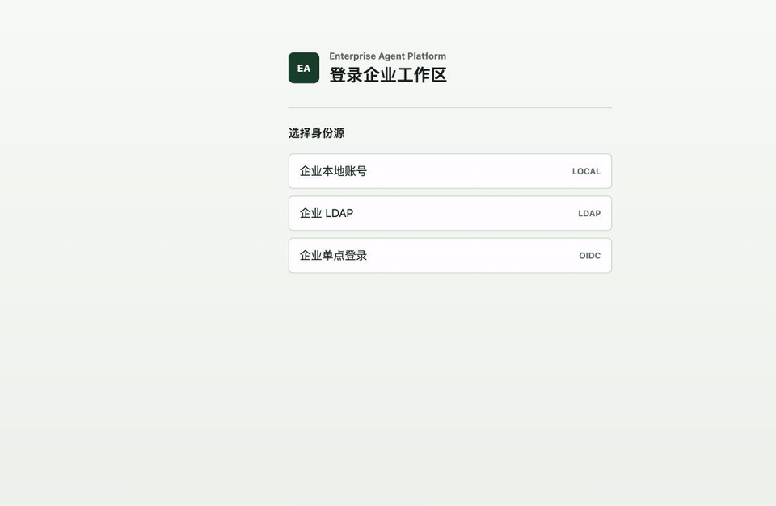

<!--
[INPUT]: 依赖 T05 认证/设备实现、OpenAPI 与当前 HTTP(S) 部署协议。
[OUTPUT]: 记录 PKCE、短期状态、Cookie/Bearer 会话和设备生命周期的验收事实。
[POS]: 身份纵向的历史验收证据；当前传输与 Cookie 语义随产品部署边界同步更新。
[PROTOCOL]: 变更时更新此头部，然后检查 CLAUDE.md
-->

# T05 PKCE 与设备验收记录

状态：`completed`

验收日期：2026-08-18（Asia/Shanghai）

## 结论

T05 已完成，且没有进入 T06。平台已为 `dsh-desktop` 与 `enterprise-admin` 两个固定 public client
建立最小 Authorization Code + PKCE 登录门面，短期状态使用 Redis 8 保存并原子消费，成功交换后由
Sa-Token 签发 12 小时非共享会话。Harness 与管理端的 redirect、installation、device type 和
Token terminal 不可混用。

设备纵向能力已覆盖 enroll、heartbeat、管理员 list/get/revoke。Runtime 授权只相信服务端会话中的
terminal，不相信 `X-Device-Id`；撤销只注销目标 installation 的 Harness Token，不影响同一用户的
其他设备。公开登录页覆盖 LOCAL、LDAP 与 OIDC 分支，LOCAL 复用 原始服务端框架 现有验证码与失败记录。

## PKCE 与短期状态

`dsh-desktop` 只允许 `http://127.0.0.1:<1024-65535>/callback` 和 UUID v4 installation；
`localhost`、其他回环地址、userinfo、fragment、额外路径和端口边界绕过均拒绝。
`enterprise-admin` 只允许部署配置中的精确 HTTP(S) redirect 且禁止 installation 参数。PKCE 固定
S256，verifier 只接受 43 至 128 个 ASCII 字符。

Redis 中登录事务与 LOCAL 首次改密 challenge TTL 为 5 分钟、授权码 TTL 为 60 秒，登录事务、
改密 challenge、OIDC state/nonce 和授权码使用独立 namespace。授权码先通过 `GETDEL` 原子消费，再检查 client、redirect、installation 和
verifier；任何不匹配、取消、过期或重放都不能恢复 code。并发交换同一 code 时仅一个请求能够创建
Sa-Token 会话。已经被消费或取消的登录事务不会产生用户绑定副作用。

## 登录页面与验证码

公开页面直接调用 `/enterprise/auth/v1/sources`，OIDC 使用浏览器跳转，LOCAL/LDAP 使用同一 HTTP(S)
密码入口。LOCAL 在密码校验前通过 `CaptchaVerifier` 验证验证码；原始服务端框架 composition adapter 复用
`CaptchaProperties`、`GlobalConstants.CAPTCHA_CODE_KEY`、Redisson `GETDEL` 和
`SysLoginService.recordLoginInfo`。LDAP 不要求验证码，验证码失败统一为 `ENT_AUTH_REQUIRED`，
不泄漏用户、密码或验证码失败原因。

登录页 LOCAL 分支调用现有 `/auth/code`，验证码可刷新、必填且具备可访问名称；LDAP 分支隐藏并
取消必填。返回身份源会清空账号、密码与验证码，防止凭据跨身份源残留。页面只在当前内存保存
transaction、CSRF 和 captcha ID，不接触平台 Token。

2026-08-21 在 T22 人工登录中修订初始化管理员流程：第一次请求只验证账号、初始密码和验证码，
成功后返回 5 分钟 Redis 一次性 challenge；页面立即清空并禁用这些旧凭据，第二次请求只提交
challenge 和新密码。challenge 以 `GETDEL` 消费，弱密码轮换 token，成功后继续原 PKCE 事务；
不新增通用密码重置端点，也不把 challenge 放进 URL 或非 JSON 表单回退。

真实 T05 静态资源通过同源无密钥 fixture server 录制，流程依次展示身份源列表、LOCAL 表单、
返回选择页和凭据已清空的 LDAP 表单：



## Sa-Token 与设备生命周期

平台会话统一设置 `is-share=false`、绝对 TTL 12 小时且不写响应 header。Harness terminal 为
`deviceType=harness, deviceId=installationId`；管理端 terminal 为
`deviceType=admin-web` 和服务端随机 session device ID。client ID 同时进入 session 与 terminal
extra，当前会话读取时重新解析固定 client 枚举。

设备 enroll 在固定 tenant 内按 installation 幂等创建或更新；已属于其他 owner 时返回新增的稳定
错误码 `ENT_DEVICE_ALREADY_BOUND`，不自动转移。heartbeat 只更新版本、插件 revision/摘要、
Session backlog 与最后同步时间白名单。管理员读写分别要求 `ent:device:read` 和
`ent:device:revoke`，revoke 使用 revision CAS，并把状态变更与审计写入同一事务。

## 协议与文档同构

唯一 OpenAPI 3.1 真源新增七个认证 operation、五个设备 operation、严格 DTO 和四个成功 fixture。
LOCAL `PasswordLoginRequest` 是初始凭据与 challenge 改密的互斥联合；`captchaId`/`captchaCode`
只属于初始 LOCAL 凭据分支。错误码集合
由 35 个增至 36 个，新增 `ENT_DEVICE_ALREADY_BOUND -> 409`，详细设计第 17 节、生成元数据、
TypeScript/Zod 与 Java JSON Schema 保持一致。

OpenAPI 导航根拆分为 `contracts/paths/auth.yaml`、`device.yaml` 和 `identity.yaml` 后为 643 行。
`types.gen.ts` 1411 行、`zod.gen.ts` 866 行是 Hey API 从完整协议确定性生成的不可手改制品；
800 行手写文件约束继续适用于业务、测试、配置和手写协议源，不以拆改生成代码制造第二真源。
新增模块均具备 L2 地图，业务、测试和静态页面文件具备 L3 INPUT/OUTPUT/POS 契约。

## 自动验收

后端完整回归实际执行：

```sh
JAVA_HOME=/usr/local/opt/openjdk@21 \
PATH=/usr/local/opt/openjdk@21/bin:$PATH \
./mvnw -B -ntp -Dmaven.test.skip=false test
```

结果：Maven 41 个 reactor 模块全部成功；`owndsh-enterprise` 53 个测试、`owndsh-server` 5 个测试
全部通过。T05 覆盖真实 Redis TTL/GETDEL/并发消费、PKCE 绕过与 code 失效矩阵、LOCAL 验证码、
Sa-Token 非共享 terminal、伪造 header、真实 PostgreSQL 设备事务和 MockMvc/OpenAPI contract。

Harness 产品 workspace 实际执行：

```sh
pnpm check
```

结果：生成漂移、typecheck、build 和 workspace 边界均通过；contracts 4、llm-gateway 4、
platform-client 8、session-sync 3、UI 2、bundle 3、workspace 4 项测试全部通过。产品源码未导入
同级 Harness 或 Typert ambient shim。

浏览器验收使用本次提交的真实 `login.html`、`login.css`、`login.js` 和同源无密钥 API fixture：

- 1280x720：三类身份源可见，LOCAL 验证码显示、必填且可刷新，LDAP 验证码隐藏且非必填。
- 390x844：`scrollWidth == clientWidth == 390`，表单、验证码与按钮无横向溢出。
- LOCAL 返回后切到 LDAP，账号和密码均为空；控制台 warning/error 为零。

边界门禁实际执行：

```sh
./scripts/bootstrap-harness.sh --check-only
node scripts/upstream-baseline.mjs verify
git diff --check
```

三项均通过；敏感日志与本任务 diff 扫描为零。同级 `deepseek-harness` 保持提交
`47f943859bef60e4160492346772ded9b24f765a` 且工作区干净，T05 没有修改任何 Harness 文件。

## 任务边界

T06 可以在独立后续任务复用认证、Token terminal 和设备 API，实现 Harness platform-client 的内存
Token、loopback listener、bootstrap 状态机和同源本地 API。T05 未提前实现 platform-client Service、
员工设置页、模型网关或 Session 同步占位。
