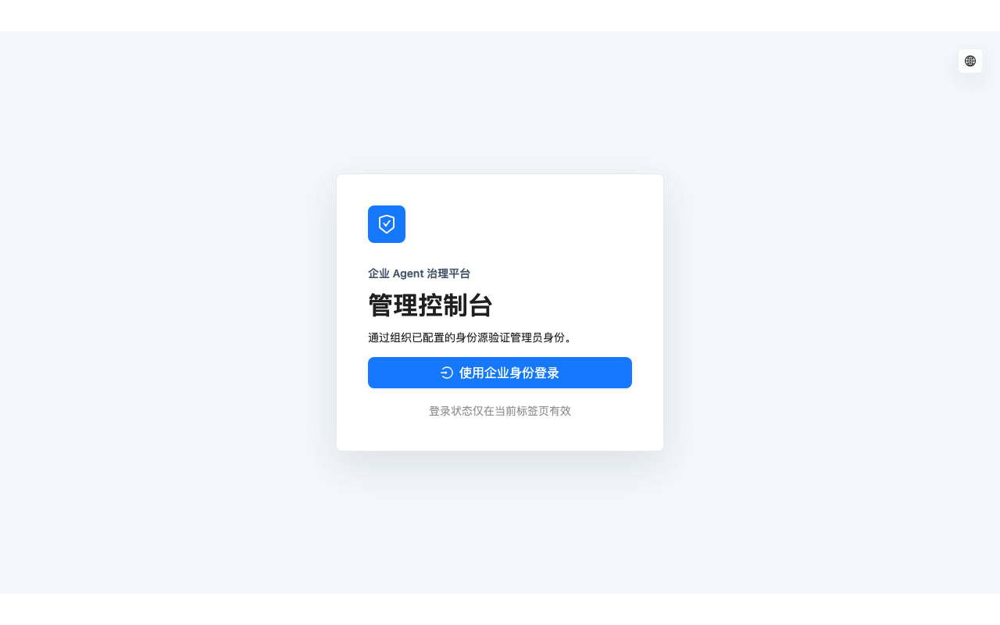

# T12 管理控制台验收记录

状态：`completed`

验收日期：2026-08-19（Asia/Shanghai）

## 结论

T12 已完成，且没有进入 T13。plus-ui React 管理端通过固定 `enterprise-admin` public client 完成
Authorization Code + PKCE 登录，在标签页内保存平台会话，并以 原始服务端框架 服务端菜单和权限码裁剪路由与操作。
身份源、组映射、用户外部身份、设备、Provider、受管模型、授权、配额窗口和 prompt-free 用量均通过真实
Server API 工作，没有 mock-only 页面、未保护端点或浏览器侧授权算法。

真实 PostgreSQL/Redis、Java Server、HTTPS 同源入口和桌面 Chromium 纵向流程已完成三次成功运行，其中
两次在同一数据库连续执行。身份源 issuer 和测试资源按运行隔离；E2E 只通过管理 API 与 `If-Match`
回收自身历史 `t12-*` 默认授权，不清库、不直写数据库、不触碰非 T12 数据。

## 核心实现

- 管理登录使用 Web Crypto 生成 S256 challenge；state/verifier 只进入 `sessionStorage` 并在回调时一次性
  消费。登录、认证静态页与 API 由 HTTPS 单 origin 承载，管理回调固定为协议登记地址。
- 全局请求边界只为企业 API 注入标签页内的 Bearer Token，401/403 清理失效会话；公开认证 operation
  不携带 Token，浏览器不保存 refresh token、上游 Key 或服务端 cursor 明文语义。
- 动态路由继续以 Server 返回菜单和 `ent:*` 权限码为事实。身份、设备、模型、授权和配额页面分别裁剪
  读取、写入和状态动作，不把隐藏按钮当成服务端授权替代品。
- 身份源支持 OIDC/LDAP 创建、编辑、连接测试、启停与外部组映射；内置 LOCAL 类型保持只读。Server
  只返回 `secretConfigured` 和固定诊断码，最近测试结果由 V7 migration 独立持久化。
- 原始服务端框架 用户详情按 `ent:identity:read` 读取外部身份摘要，只显示来源、类型、稳定 subject 与最后登录时间，
  不返回 groups、claims 或凭据。
- 设备列表展示 revision、插件清单摘要、待同步事件和最后成功同步时间；撤销使用当前 Server revision，成功后
  以返回事实刷新，状态列直接显示 ACTIVE/REVOKED。
- Provider/模型、授权、配额和用量页面共享服务端 cursor 与 revision 冲突恢复策略。冲突只重载当前事实，不
  自动重放写请求；secret 只能新建或替换，刷新后只显示“已配置”。
- 用量 API 补充当前用户名、部门和模型显示语义，但 ledger 仍只保存计费事实；响应和管理页面不包含 prompt。

## 协议与生成边界

OpenAPI 真源新增用户外部身份摘要 operation、设备观测字段、身份源最近测试投影和用量显示语义。生成入口
同时输出自包含 `contracts/generated/enterprise-openapi.json`，供 Umi OpenAPI 从同一真源生成
`admin-web/src/services/enterprise/`；手写业务 API 只包装生成 operation 并集中处理幂等键与 revision。

本任务生成后的完整逻辑协议 SHA-256 为：

```text
ba4544ef78a9530bf69a3aaba3a2e2e0612ff53a405d99c9b2caaa2aefddb5df
```

## 自动验收

Server 全 reactor 门禁：

```sh
cd backend
JAVA_HOME=/usr/local/opt/openjdk@21 \
PATH=/usr/local/opt/openjdk@21/bin:$PATH \
./mvnw -B -ntp -pl owndsh-modules/owndsh-enterprise -am \
  -Dmaven.test.skip=false -DskipTests=false test
```

结果：11 个 reactor 模块成功，94 项测试零失败；覆盖 V1-V7 空库/升级、静态认证资源、身份/设备管理
投影、协议 schema、权限注解、CAS、审计事务和真实 PostgreSQL/Redis 边界。

管理端快速门禁：

```sh
cd admin-web
corepack pnpm@10.34.5 test
corepack pnpm@10.34.5 lint
corepack pnpm@10.34.5 build
```

结果：Vitest 4 个文件、9 项行为测试通过；Oxlint、OpenAPI 重生成、Umi setup 和 TypeScript 通过；生产构建
完成 7,239 个模块。测试覆盖 PKCE 一次性事务、mutation headers、权限裁剪、表单边界和 Umi model
自动发现隔离。

协议与 Harness 回归门禁：

```sh
cd plugin
corepack pnpm@11.7.0 --filter @owndsh/contracts generate
corepack pnpm@11.7.0 --filter @owndsh/contracts check:generated
corepack pnpm@11.7.0 run check
```

结果：OpenAPI、自包含 JSON、JSON Schema 和 TypeScript/Zod 生成物无漂移；Harness 六个产品 package 的
typecheck/build/test 与 workspace 不变量全部通过。全量门禁曾捕获 platform-client 的 enroll 测试替身仍是
旧 DeviceResponse，补齐四个必填观测字段后定向 4 文件/18 项及最终 workspace 回归均通过；生产 Host
代码没有放宽严格 schema。

## 真实管理流程

```sh
cd admin-web
corepack pnpm@10.34.5 test:e2e
```

Playwright 使用 Docker PostgreSQL 17/Redis 8、Java 21 Server、无 mock API 的 Umi 管理端、本地 HTTPS
入口以及按路径隔离的 OIDC/DeepSeek-compatible 外部替身，串行完成：

1. 管理员经 LOCAL + PKCE 登录并取得真实服务端菜单。
2. 创建唯一 issuer 的 OIDC 身份源，测试连接且刷新后不回显 client secret。
3. 创建 Provider 和受管模型，连接测试后把模型分配给真实员工并设为默认。
4. 员工经 OIDC + PKCE 登录、登记设备并从 bootstrap 看到新模型，证明管理修改实际生效。
5. 以过期 revision 触发冲突，页面重载服务端事实后再成功撤销设备。
6. 验证 ACTIVE 与 REVOKED 状态、插件/同步观测字段和全部管理响应均无 secret 原值。

同一数据库的连续两次运行和最终媒体运行均通过，证明场景可重复且不依赖清库。最终五帧 GIF 为
`1280x800`、10 秒，包含登录、身份源、受管模型、ACTIVE 设备和 REVOKED 设备：



## 安全与上游边界

仓库级敏感模式扫描的命中均为显式测试假 Token/secret，没有生产 credential、上游 Key、client secret 或明文密码。
页面、截图和 GIF 不显示 Token 或 secret；数据库身份源/Provider 凭据继续只保存 AES-GCM 密文。

上游三锁验证、`./scripts/bootstrap-harness.sh --check-only` 和 Harness workspace 门禁均校验同级
`deepseek-harness` 精确位于 `99f6f02fecdb7dff40c3fbc9470f5907c29f74ca`（`0.1.0-rc.7`）且工作区
干净。本任务没有修改任何 Harness 文件。

## 任务边界

T13 可以在独立后续任务开始插件服务端。T12 没有提前实现插件制品、客户端安装、Session、副本、审计页、
部署或移动端；详细设计中的 T13-T23 仍为 `pending`。
