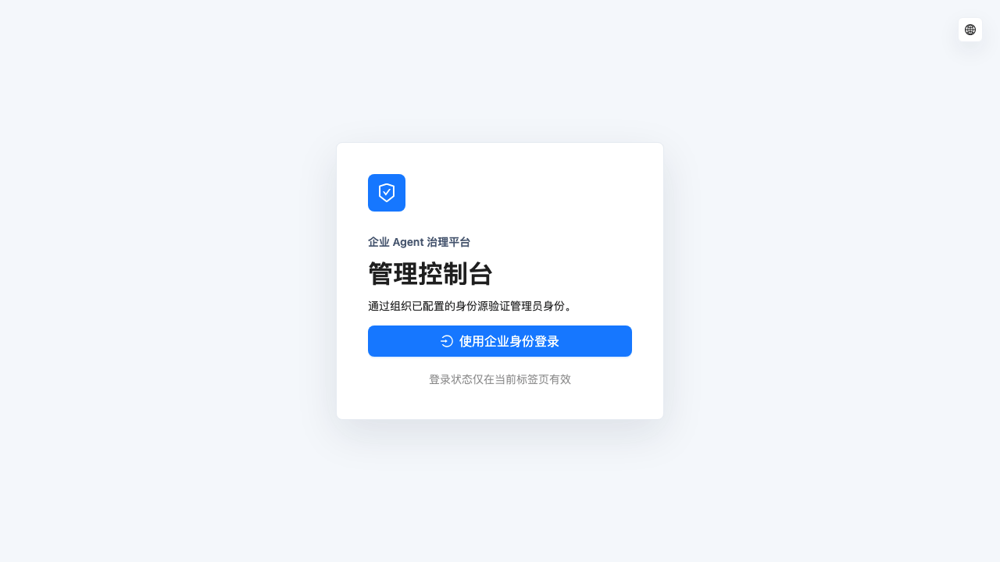

# T15 插件页面验收记录

状态：`completed`

验收日期：2026-08-19（Asia/Shanghai）

## 结论

T15 已完成，且没有进入 T16。管理端通过真实插件 Server API 交付 tgz 上传、发布、退休、ALL/DEPT/USER
完整分配、旧版本回滚和设备 inventory；桌面员工端只读取 Host 同源插件投影，在官方 Settings 的企业
section 中展示期望版本、本地版本、`RESTART_REQUIRED`、`ACTIVE` 和稳定错误码。

真实 rc.7 Harness 使用官方 `dsh plugin add` 安装平台签名测试 bundle。当前进程显示等待重启，同一临时
profile 重启后由官方 Loader inventory 确认 active，再显示已启用。验收器最终通过控制端点自行清理并以
0 退出；同级 Harness 始终位于锁定 commit 且工作区干净。

## 核心实现

- 管理 catalog 的 `PluginPackage.assignments` 是必填完整集合。assignment batch 是基于 package revision
  的全量原子替换，页面从完整服务端事实初始化并回传完整集合，避免编辑一个 subject 时误删其他 subject。
- 管理插件工作台提供 catalog 与设备状态两个视图。上传只接收不超过 50 MiB 的 tgz 和明确 compatibility；
  发布/退休使用版本 revision，分配/回滚使用 package revision 与幂等键，CAS 冲突只重载最新事实而不自动重放。
- ALL、DEPT、USER 与 INSTALLED、ABSENT 在同一抽屉编辑；同一 subject 前端拒绝重复，服务端继续承担版本归属、
  PUBLISHED 状态、唯一约束、权限和事务裁决。回滚复用同一全量集合，只把目标版本切换到仍为 PUBLISHED 的旧版。
- 员工插件 tab 复用三个官方 slot 的共享 `EnterpriseAccountStore`，只访问
  `/enterprise/api/v1/local/plugins`。SHA-256 和 restart marker 参与严格解码后在进入 React snapshot 前删除；
  tgz 路径、公钥、CLI 输出、Token 和平台 origin 均不进入浏览器状态。
- 插件四列使用可收缩网格；真实 1103x720 Harness 内容区验证 `clientWidth=scrollWidth=564`，长 package 和状态
  文案不再触发横向溢出。移动端仍属于详细设计第 2.3 节明确不做范围。

## 协议与 Server

OpenAPI `PluginPackage` 新增必填、最多 200 项的 `assignments`，Java view、管理端生成客户端与
TypeScript/Zod 生成物同步更新。逻辑协议 SHA-256 为：

```text
123204f96562c0c703b4d4fa0dc3878a2497cfe6479e985face6b178e22227d9
```

Server catalog 在同一 package 投影中返回 versions 与 assignments；既有 runtime assignment 仍只返回当前用户
按 USER > DEPT > ALL 解析后的有效结果，没有把管理集合暴露给员工端。

## 自动验收

实际执行并通过以下门禁：

```sh
cd backend
JAVA_HOME=/usr/local/opt/openjdk@21 \
PATH=/usr/local/opt/openjdk@21/bin:$PATH \
./mvnw -B -ntp -pl owndsh-modules/owndsh-enterprise -am \
  -Dmaven.test.skip=false -DskipTests=false test

cd ../admin-web
corepack pnpm@10.34.5 test
corepack pnpm@10.34.5 lint
corepack pnpm@10.34.5 build
ENT_E2E_BASE_URL=https://localhost corepack pnpm@10.34.5 test:e2e

cd ../plugin
corepack pnpm@11.7.0 --filter @owndsh/contracts check:generated
corepack pnpm@11.7.0 run check
corepack pnpm@11.7.0 run pack:bundle
corepack pnpm@11.7.0 run accept:t15-browser

cd ..
node scripts/upstream-baseline.mjs verify
./scripts/bootstrap-harness.sh --check-only
git diff --check
```

管理单测覆盖 mutation headers、读取权限与写操作裁剪；Server 回归覆盖完整 catalog assignments 与严格协议；
Harness 测试覆盖十一种受管状态文案、READY 插件刷新、字段严格解码和秘密投影。Backend 11 模块 reactor
共通过 108 项测试；管理端 Vitest 6 个文件共 14 项、lint 和 7,247 模块生产构建通过；完整 Playwright
套件 2 个真实纵向场景在 51.7 秒内通过。Harness 的 contracts 7 项、UI 9 项、session 3 项、platform
18 项、LLM 14 项、distribution 11 项、bundle 3 项和 workspace 4 项测试全部通过，真实 bundle pack、
浏览器重启验收及协议漂移检查也均以 0 退出。

## 真实管理与 Harness 流程

最终完整 Server Playwright 中，T15 场景在 21.4 秒内完成：两个独立 tgz 上传与发布、ALL/DEPT/USER
原子分配、package revision CAS 冲突恢复、三条 assignment 回滚到旧 PUBLISHED 版本、新版本退休，以及
ACTIVE 设备 inventory。E2E 只通过管理 API 和员工 API 创建数据，不直接写数据库。

真实 Harness 浏览器流程执行：

```sh
cd plugin
corepack pnpm@11.7.0 --filter owndsh-plugin build
corepack pnpm@11.7.0 run pack:bundle
corepack pnpm@11.7.0 run accept:t15-browser
```

验收器生成并签名 `@example/t15-managed-tools@1.0.0`，真实 bootstrap 下发 assignment，真实
`ctx.subprocess` 执行官方 CLI；重启前为 `RESTART_REQUIRED`，重启后官方 Loader inventory 为 active，页面
显示 `ACTIVE`。页面正文不含内存 Token，验收结束后临时 `DSH_HOME` 已删除，命令退出码为 0。

五个无密钥快照合成为 `1280x720`、10 秒、100 帧的真实流程 GIF：



## 品味自检

- 页面只编排协议操作，tgz 验包、签名、授权、状态机和 assignment 原子性仍由既有 Server/Host 所有者负责。
- 全量替换语义在协议中显式成为完整集合，避免“局部表单看似成功、实际删除不可见 subject”的隐性数据损坏。
- 员工 UI 不复制分发状态机，只投影 Host 事实；账号与插件继续共享单一 store 和同源 API，没有新增 Remote 或私有 Harness 接口。
- 新增业务文件均低于 800 行并具备 L3；API、页面、测试、脚本、媒体与 docs 的 L2/L1 地图已同步回环。

## 任务边界

T16 是唯一下一项：实现 Session replica/batch/event、字节 hash、AES-GCM、list/export/delete、正文权限和
retention。T16 独立验收并提交前不得开始 T17；T15 没有预建 Session 页面、同步队列或恢复入口。
